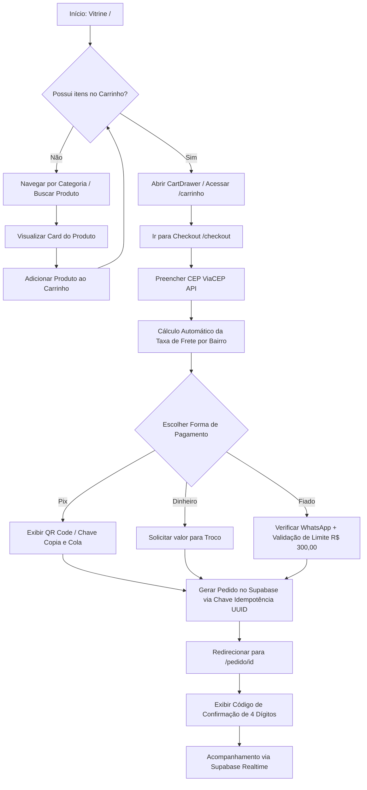
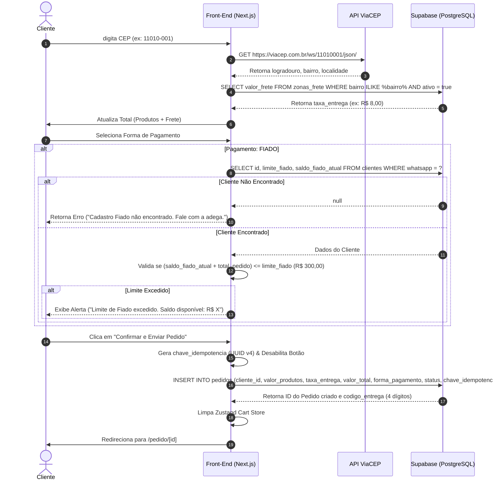

# 📄 SPEC-02-STOREFRONT: Especificação Técnica e Arquitetura do Front-End Público

**Projeto:** TELES ADEGA DELIVERY  
**DDD / Região:** (13) - Baixada Santista  
**Contato Oficial:** WhatsApp (13) 99765-0605 | Instagram [@teles.adegadelivery](https://instagram.com/teles.adegadelivery)  
**Identidade Visual:** Dark Theme (`#0D0D0D`), Amarelo Ouro (`#F59E0B`), Verde WhatsApp (`#22C55E`)  
**Stack Front-End:** Next.js 14/15 (App Router), React 18+, Tailwind CSS v3/v4, Zustand (State Management + LocalStorage), Supabase JS Client (`@supabase/supabase-js`), Lucide React Icons  
**Autor:** Engenheiro de Software Sênior (Front-End & UI/UX Architect)  
**Versão:** 1.0.0  
**Data:** 11/08/2026  

---

## 1. Visão Geral & Arquitetura do Front-End

O Front-End Público do **TELES ADEGA DELIVERY** é projetado como uma **Single Page Experience** extremamente veloz, responsiva e otimizada para dispositivos móveis (Mobile-First). O objetivo primário é permitir que o cliente navegue pelos produtos, escolha bebidas geladas, informe o endereço e finalize o pedido em menos de 60 segundos.

### 1.1 Guia de Tokens e Identidade Visual (Design Tokens)

| Token / Variável | Valor Hex / CSS | Aplicação no Layout |
| :--- | :--- | :--- |
| **`bg-background`** | `#0D0D0D` | Fundo principal da aplicação (Dark Puro) |
| **`bg-surface`** | `#161616` | Fundo de cards, drawers, modais e inputs |
| **`bg-surface-hover`** | `#222222` | Estado hover de cards e itens interativos |
| **`border-color`** | `#262626` | Divisores, bordas de cards e inputs |
| **`accent-yellow`** | `#F59E0B` | Cor primária da marca (Badges, destaques, bordas ativas) |
| **`accent-yellow-hover`**| `#D97706` | Estado hover/active de botões principais |
| **`brand-whatsapp`** | `#22C55E` | Botão do WhatsApp, alertas positivos, badges de confirmação |
| **`text-primary`** | `#FFFFFF` | Títulos, preços, nome de produtos e código de entrega |
| **`text-secondary`** | `#A1A1AA` | Descrições, categorias secundárias, placeholders |
| **`text-muted`** | `#71717A` | Rodapé, marcas d'água e informações suplementares |
| **`status-danger`** | `#EF4444` | Alertas de erro, estoque esgotado, cancelamento |

---

### 1.2 Diagrama do Fluxo de Navegação do Cliente (Mermaid)



---

## 2. Estrutura de Pastas e Roteamento (Next.js App Router)

A estrutura de diretórios foi desenhada seguindo as melhores práticas do Next.js App Router, garantindo forte separação de responsabilidades (Clean Architecture).

```text
src/
├── app/
│   ├── layout.tsx                 # Root Layout (Dark Mode, Provedores, Fonts)
│   ├── page.tsx                   # / (Landing Page / Vitrine Pública)
│   ├── carrinho/
│   │   └── page.tsx               # /carrinho (Página Completa do Carrinho)
│   ├── checkout/
│   │   └── page.tsx               # /checkout (Formulário de Entrega e Pagamento)
│   ├── pedido/
│   │   └── [id]/
│   │       └── page.tsx           # /pedido/[id] (Acompanhamento em Tempo Real)
│   └── globals.css                # Estilos globais Tailwind + variáveis CSS
├── components/
│   ├── layout/
│   │   ├── Header.tsx             # Topbar com logo, status da loja e contador
│   │   ├── Footer.tsx             # Contatos oficiais e redes sociais
│   │   └── CartDrawer.tsx         # Drawer lateral do carrinho (Off-canvas)
│   ├── storefront/
│   │   ├── HeroSection.tsx        # Banner principal de boas-vindas e slogan
│   │   ├── CategoryTabs.tsx       # Filtro por categorias com scroll horizontal
│   │   ├── ProductCard.tsx        # Card individual de produto com contador
│   │   └── ProductGrid.tsx        # Grid responsivo de produtos filtrados
│   ├── checkout/
│   │   ├── AddressCheckoutForm.tsx # Formulário de CEP, busca ViaCEP e Frete
│   │   ├── PaymentSelector.tsx    # Seletor de forma de pagamento (Pix, Dinheiro, Fiado)
│   │   ├── FiadoValidationModal.tsx# Modal de validação de cliente para Fiado
│   │   └── OrderSummary.tsx       # Resumo de valores (Produtos + Frete = Total)
│   └── order/
│       ├── ConfirmationCodeCard.tsx# Destaque visual do Código de 4 Dígitos
│       └── OrderStatusStepper.tsx # Stepper animado do status do pedido (Realtime)
├── store/
│   └── useCartStore.ts            # Zustand Store com persistência em localStorage
├── services/
│   ├── viaCep.ts                  # Consumo da API pública ViaCEP
│   ├── supabaseClient.ts          # Cliente Supabase Singleton para Front-End
│   └── orderService.ts            # Criação e consulta de pedidos no Supabase
├── types/
│   ├── storefront.ts              # Interfaces de Categoria, Produto e Carrinho
│   └── checkout.ts                # Interfaces de Endereço, Frete e Pedido
└── hooks/
    ├── useHydrated.ts             # Custom hook para evitar Hydration Mismatch
    └── useOrderRealtime.ts        # Hook para escutar atualizações via Supabase Realtime
```

---

### 2.1 Mapeamento Detalhado de Rotas Públicas

#### Rota 1: Vitrine Principal (`/`)
- **Objetivo:** Exibir produtos ordenados por categorias com carregamento instantâneo.
- **Componentes Renderizados:** `Header`, `HeroSection`, `CategoryTabs`, `ProductGrid`, `CartDrawer`, `Footer`.
- **Estratégia de Renderização:** Server Component para busca inicial de categorias e produtos ativos no Supabase (SSR com revalidação dinâmica ISR 60s) + Client Components para interatividade do carrinho e filtros.

#### Rota 2: Carrinho de Compras (`/carrinho`)
- **Objetivo:** Visualização em tela cheia do carrinho de compras para dispositivos móveis ou desktop.
- **Componentes Renderizados:** `Header`, `CartItemList`, `OrderSummary`, `Footer`.
- **Funcionalidades:** Alteração de quantidades, remoção de itens, visualização do subtotal parcial e botão para prosseguir ao checkout.

#### Rota 3: Checkout (`/checkout`)
- **Objetivo:** Coleta de dados do cliente, busca dinâmica de frete por CEP e finalização do pedido.
- **Componentes Renderizados:** `Header`, `AddressCheckoutForm`, `PaymentSelector`, `OrderSummary`.
- **Validações:** Validação de formato de CEP, auto-preenchimento de logradouro/bairro, conferência de frete na tabela `zonas_frete`, consulta de saldo para modalidade `fiado` e envio idempotente.

#### Rota 4: Status do Pedido (`/pedido/[id]`)
- **Objetivo:** Exibição do código de confirmação de 4 dígitos para entrega e acompanhamento do progresso em tempo real.
- **Componentes Renderizados:** `Header`, `ConfirmationCodeCard`, `OrderStatusStepper`, `OrderDetailsSummary`.
- **Integração:** Inscrição via WebSocket Supabase Realtime no registro do pedido correspondente.

---

## 3. Especificação Detalhada dos Componentes Chave

### 3.1 `Header`
- **Comportamento:** Fixo no topo (`sticky top-0 z-40`), fundo semitransparente com efeito glassmorphism (`bg-[#0D0D0D]/90 backdrop-blur-md border-b border-[#262626]`).
- **Conteúdo:**
  - Logo "TELES ADEGA DELIVERY" em amarelo ouro (`#F59E0B`).
  - Badge de status da loja: "🟢 Aberto Agora" ou "🔴 Fechado".
  - Link direto para atendimento via WhatsApp com o número oficial `(13) 99765-0605`.
  - Botão de abertura do `CartDrawer` exibindo o ícone de sacola/carrinho e o badge dinâmico com o número de itens.

```typescript
// Interface de Props do Header
export interface HeaderProps {
  onOpenCart: () => void;
}
```

---

### 3.2 `HeroSection`
- **Comportamento:** Banner responsivo com fundo escuro e detalhes reluzentes em tom dourado/amarelo.
- **Slogans Oficiais:**
  - Título Principal: *"Gelada na sua porta em minutos!"*
  - Subtítulo: *"Rápido, Gelado, Confiável. Entregas na Baixada Santista."*
- **Ações:** Botão CTA "Ver Bebidas Geladas" que faz scroll suave (`smooth scroll`) até a seção `CategoryTabs`.

---

### 3.3 `CategoryTabs`
- **Comportamento:** Barra horizontal com scroll touch (`overflow-x-auto scrollbar-none`) contendo os chips de categorias.
- **Categorias Base:** Todas, Cervejas, Destilados, Vinhos, Combos, Gelo & Carvão, Sem Álcool.
- **Estados Visuais:**
  - **Inativo:** Fundo `#161616`, texto `#A1A1AA`, borda `#262626`.
  - **Ativo:** Fundo `#F59E0B`, texto `#0D0D0D` (fonte bold), sombra leve dourada.

---

### 3.4 `ProductCard`
- **Comportamento:** Card retangular com bordas arredondadas (`rounded-xl`), fundo `#161616` e transição de elevação no hover.
- **Elementos Visuais:**
  - Imagem do produto (`next/image`) com aspecto 1:1 e badge de estoque baixo se `estoque_atual <= estoque_minimo`.
  - Nome do produto em destaque (`text-white font-semibold`).
  - Descrição resumida em no máximo 2 linhas (`line-clamp-2 text-zinc-400`).
  - Preço formatado em Reais (ex: `R$ 14,90`).
  - Botão de Ação: Botão "+ Adicionar" em amarelo ouro ou seletor de quantidade `[-] Qtd [+]` quando o item já estiver no carrinho.
  - Estado Desabilitado: Se `estoque_atual === 0` ou `ativo === false`, exibe overlay "Esgotado".

---

### 3.5 `CartDrawer`
- **Comportamento:** Painel lateral deslizante (Slide-over) ocupando a direita da tela (`w-full max-w-md bg-[#161616]`).
- **Recursos:**
  - Lista com rolagem independente contendo os itens adicionados.
  - Cada item exibe thumbnail, nome, preço unitário, botões `+`/`-` para ajustar quantidade e ícone de lixeira para remover.
  - Rodapé fixo contendo o Subtotal dos produtos, aviso de cálculo de frete no checkout e botão em destaque "Finalizar Pedido" em verde WhatsApp (`#22C55E`).

---

### 3.6 `AddressCheckoutForm`
- **Comportamento:** Formulário em etapas para preenchimento de endereço e cálculo dinâmico de taxa de entrega.
- **Campos:**
  - CEP (`VARCHAR(9)` com máscara `00000-000`): Ao preencher 8 dígitos, dispara busca assíncrona na API ViaCEP.
  - Logradouro/Rua (auto-preenchido, editável).
  - Número (obrigatório) e Complemento (opcional).
  - Bairro (auto-preenchido via ViaCEP e mapeado na tabela `zonas_frete`).
  - Ponto de Referência (opcional, para orientar o motoboy).

---

## 4. Gerenciamento de Estado do Carrinho (Zustand)

O gerenciamento de estado global da sacola de compras utiliza a biblioteca **Zustand** com o middleware `persist` para sincronização automática com o `localStorage` do navegador.

### 4.1 Definição do Contrato de Tipos (`src/types/storefront.ts`)

```typescript
export interface Produto {
  id: string;
  categoria_id: string;
  nome: string;
  descricao?: string;
  preco: number;
  foto_url?: string;
  estoque_atual: number;
  estoque_minimo: number;
  ativo: boolean;
}

export interface CartItem {
  produto: Produto;
  quantidade: number;
  precoUnitario: number;
  subtotal: number;
}

export interface CartStoreState {
  itens: CartItem[];
  taxaEntrega: number;
  bairroSelecionado: string | null;
  
  // Ações
  addItem: (produto: Produto, quantidade?: number) => void;
  removeItem: (produtoId: string) => void;
  updateQuantity: (produtoId: string, quantidade: number) => void;
  clearCart: () => void;
  setDeliveryZone: (bairro: string, taxa: number) => void;
  
  // Getters / Computados
  getSubtotal: () => number;
  getTotal: () => number;
  getItemCount: () => number;
}
```

---

### 4.2 Implementação da Store Zustand (`src/store/useCartStore.ts`)

```typescript
import { create } from 'zustand';
import { persist, createJSONStorage } from 'zustand/middleware';
import { CartStoreState, Produto } from '@/types/storefront';

export const useCartStore = create<CartStoreState>()(
  persist(
    (set, get) => ({
      itens: [],
      taxaEntrega: 0,
      bairroSelecionado: null,

      addItem: (produto: Produto, quantidade = 1) => {
        const { itens } = get();
        const itemExistente = itens.find((i) => i.produto.id === produto.id);

        if (itemExistente) {
          const novaQtd = Math.min(
            itemExistente.quantidade + quantidade,
            produto.estoque_atual
          );
          set({
            itens: itens.map((i) =>
              i.produto.id === produto.id
                ? {
                    ...i,
                    quantidade: novaQtd,
                    subtotal: novaQtd * i.precoUnitario,
                  }
                : i
            ),
          });
        } else {
          const qtdInicial = Math.min(quantidade, produto.estoque_atual);
          set({
            itens: [
              ...itens,
              {
                produto,
                quantidade: qtdInicial,
                precoUnitario: produto.preco,
                subtotal: qtdInicial * produto.preco,
              },
            ],
          });
        }
      },

      removeItem: (produtoId: string) => {
        set({
          itens: get().itens.filter((i) => i.produto.id !== produtoId),
        });
      },

      updateQuantity: (produtoId: string, quantidade: number) => {
        if (quantidade <= 0) {
          get().removeItem(produtoId);
          return;
        }

        set({
          itens: get().itens.map((i) => {
            if (i.produto.id === produtoId) {
              const novaQtd = Math.min(quantidade, i.produto.estoque_atual);
              return {
                ...i,
                quantidade: novaQtd,
                subtotal: novaQtd * i.precoUnitario,
              };
            }
            return i;
          }),
        });
      },

      clearCart: () => {
        set({ itens: [], taxaEntrega: 0, bairroSelecionado: null });
      },

      setDeliveryZone: (bairro: string, taxa: number) => {
        set({ bairroSelecionado: bairro, taxaEntrega: taxa });
      },

      getSubtotal: () => {
        return get().itens.reduce((acc, item) => acc + item.subtotal, 0);
      },

      getTotal: () => {
        return get().getSubtotal() + get().taxaEntrega;
      },

      getItemCount: () => {
        return get().itens.reduce((acc, item) => acc + item.quantidade, 0);
      },
    }),
    {
      name: 'teles_adega_cart_v1',
      storage: createJSONStorage(() => localStorage),
      partialize: (state) => ({
        itens: state.itens,
        taxaEntrega: state.taxaEntrega,
        bairroSelecionado: state.bairroSelecionado,
      }),
    }
  )
);
```

---

### 4.3 Prevenção de Hydration Mismatch no SSR

Para evitar erros de inconsistência entre o HTML gerado no servidor e o estado persistido no `localStorage` do cliente, é obrigatório utilizar o custom hook `useHydrated`:

```typescript
// src/hooks/useHydrated.ts
import { useState, useEffect } from 'react';

export function useHydrated() {
  const [hydrated, setHydrated] = useState(false);

  useEffect(() => {
    setHydrated(true);
  }, []);

  return hydrated;
}
```

---

## 5. Fluxo do Checkout & Validações de Negócio

### 5.1 Diagrama Sequencial de Integração do Checkout (Mermaid)



---

### 5.2 Validação de Endereço via API ViaCEP e Tabela `zonas_frete`

1. **Consulta HTTP:** A função `buscarCep(cep: string)` envia uma requisição `GET` para `https://viacep.com.br/ws/{cep}/json/`.
2. **Tratamento de CEP Inválido/Não Encontrado:** Se a API retornar `{ erro: true }`, o sistema exibe a mensagem de erro *"CEP não encontrado. Por favor, verifique os números digitados."*
3. **Cálculo da Taxa de Entrega:**
   - O bairro retornado pelo ViaCEP é enviado para consulta no Supabase:
     ```sql
     SELECT valor_frete 
     FROM zonas_frete 
     WHERE bairro ILIKE %bairro_viacep% 
       AND ativo = true 
     LIMIT 1;
     ```
   - Se o bairro não constar na tabela `zonas_frete`, o sistema informa: *"Região fora da área de entrega direta. Entre em contato via WhatsApp para consultar taxa especial."*

---

### 5.3 Regras de Negócio por Forma de Pagamento

#### A) Pix (QR Code / Copia e Cola)
- O pedido é gravado com status inicial `'aguardando_pagamento'`.
- O cliente visualiza a chave Pix (E-mail / Telefone ou Copia e Cola da adega).
- Instrução visual: *"Assim que realizar a transferência, seu pedido será enviado para o preparo!"*

#### B) Dinheiro
- Exige o preenchimento do campo obrigatório *"Troco para quanto?"* (ex: R$ 50,00 ou R$ 100,00).
- É validado se o valor informado para troco é **maior ou igual** ao valor total do pedido.
- O pedido é gravado com status `'pendente_aprovacao'`.

#### C) Fiado (Exclusivo para Clientes Cadastrados)
- Exige a digitação e validação do número de WhatsApp do cliente.
- Consulta os limites cadastrais na tabela `clientes`:
  - **Condição de Aprovação:** `(saldo_fiado_atual + valor_total_pedido) <= limite_fiado`.
  - **Limite Padrão:** R$ 300,00 por cliente cadastrado.
- Se o cliente exceder o limite, o pedido é bloqueado no front-end com o alerta: *"Não foi possível aprovar a compra no Fiado. Limite indisponível no momento. Escolha Pix ou Dinheiro."*

---

### 5.4 Garantia de Idempotência contra Clique Duplo (Double Click Protection)

Para impedir a criação duplicada de pedidos por instabilidade de rede ou cliques repetidos do cliente:

1. **Geração de Chave Única:** Antes de disparar a requisição `INSERT`, o cliente gera um UUID v4 via `crypto.randomUUID()`.
2. **Envio da Chave:** A propriedade `chave_idempotencia` é enviada no payload do pedido para o Supabase.
3. **Constraint de Banco:** A coluna `chave_idempotencia` possui restrição `UNIQUE` no PostgreSQL (definida no `SPEC-01-DATABASE.md`).
4. **UI State:** O botão "Confirmar Pedido" passa imediatamente para o estado `loading` (`disabled={isSubmitting}`), alterando o texto para *"Processando seu pedido..."*.

---

## 6. Tela de Acompanhamento do Pedido (`/pedido/[id]`)

### 6.1 Destaque Visual do Código de Confirmação (4 Dígitos)

Na entrega das bebidas geladas, a confirmação do pedido pelo motoboy exige a validação do **Código de Entrega de 4 Dígitos** gerado automaticamente pelo banco de dados.

- **Design do Elemento:** Card em destaque no topo da tela com borda dourada piscante / suave glow em amarelo ouro (`border-2 border-[#F59E0B] bg-[#161616] p-6 rounded-2xl shadow-lg shadow-[#F59E0B]/10`).
- **Exibição dos Dígitos:** Cada número é renderizado em um bloco individual grande (fonte de 32px a 48px monospace, bold, cor branca).
- **Texto de Instrução:**  
  > 📌 **"Informe este código de 4 dígitos ao motoboy no momento da entrega para liberar seu pedido."**

```tsx
// Exemplo de Estrutura do Card do Código de 4 Dígitos
<div className="flex flex-col items-center justify-center border-2 border-[#F59E0B] bg-[#161616] p-6 rounded-2xl">
  <span className="text-sm font-medium text-[#A1A1AA] uppercase tracking-wider">
    Código de Confirmação
  </span>
  <div className="flex gap-3 my-4">
    {codigoEntrega.split('').map((digito, index) => (
      <div 
        key={index} 
        className="w-12 h-14 bg-[#0D0D0D] border border-[#F59E0B] rounded-xl flex items-center justify-center text-3xl font-mono font-bold text-[#F59E0B]"
      >
        {digito}
      </div>
    ))}
  </div>
  <p className="text-xs text-center text-zinc-400 max-w-xs">
    Apresente este código ao entregador ao receber suas bebidas geladas.
  </p>
</div>
```

---

### 6.2 Linha do Tempo e Transições de Status via Supabase Realtime

A tela escuta as alterações da tabela `pedidos` através do WebSocket nativo do Supabase (`@supabase/supabase-js`).

#### Mapeamento Visual dos Status:

| Enum `status_pedido` | Rótulo Amigável na UI | Ícone Visual | Cor do Indicador |
| :--- | :--- | :--- | :--- |
| **`aguardando_pagamento`** | Aguardando Pagamento Pix | `CreditCard` | Amarelo (`#F59E0B`) |
| **`pendente_aprovacao`** | Pedido Recebido pela Adega | `Clock` | Azul (`#3B82F6`) |
| **`em_preparo`** | Bebidas Separadas & Gelando | `PackageCheck` | Roxo / Laranja (`#F97316`) |
| **`em_rota`** | Motoboy a Caminho! | `Bike` / `Truck` | Verde WhatsApp (`#22C55E`) |
| **`entregue`** | Pedido Entregue com Sucesso | `CheckCircle2` | Verde WhatsApp (`#22C55E`) |
| **`cancelado`** | Pedido Cancelado | `XCircle` | Vermelho (`#EF4444`) |

---

### 6.3 Hook Supabase Realtime (`src/hooks/useOrderRealtime.ts`)

```typescript
import { useEffect, useState } from 'react';
import { supabase } from '@/services/supabaseClient';

export interface OrderRealtimeData {
  id: string;
  status: 'aguardando_pagamento' | 'pendente_aprovacao' | 'em_preparo' | 'em_rota' | 'entregue' | 'cancelado';
  codigo_entrega: string;
  valor_total: number;
  atualizado_em: string;
}

export function useOrderRealtime(pedidoId: string, initialData: OrderRealtimeData) {
  const [pedido, setPedido] = useState<OrderRealtimeData>(initialData);

  useEffect(() => {
    if (!pedidoId) return;

    // Subscreve ao canal de mudanças na tabela 'pedidos' para o ID específico
    const channel = supabase
      .channel(`order-status-${pedidoId}`)
      .on(
        'postgres_changes',
        {
          event: 'UPDATE',
          schema: 'public',
          table: 'pedidos',
          filter: `id=eq.${pedidoId}`,
        },
        (payload) => {
          const novoPedido = payload.new as OrderRealtimeData;
          setPedido(novoPedido);

          // Efeito sonoro / Notificação ao mudar para 'em_rota' ou 'entregue'
          if (novoPedido.status === 'em_rota' && typeof window !== 'undefined') {
            const audio = new Audio('/sounds/notification.mp3');
            audio.play().catch(() => {});
          }
        }
      )
      .subscribe();

    return () => {
      supabase.removeChannel(channel);
    };
  }, [pedidoId]);

  return { pedido };
}
```

---

## 7. Definição de Pronto (Definition of Done - DoD)

Para considerar a especificação do Front-End Público homologada e pronta para a fase de implementação dos componentes, a seguinte checklist deve ser integralmente validada:

- [x] **Compatibilidade de Rotas:** Mapeamento completo das rotas `/`, `/carrinho`, `/checkout` e `/pedido/[id]` no App Router.
- [x] **Fidelidade de Identidade Visual:** Respeito integral à paleta escuro/dark (`#0D0D0D`), detalhes em Amarelo Ouro (`#F59E0B`) e Verde WhatsApp (`#22C55E`).
- [x] **Gerenciamento de Estado:** Zustand Store configurada com persistência em `localStorage` e mecanismo de prevenção de Hydration Mismatch.
- [x] **Integração ViaCEP:** Fluxo de auto-preenchimento de endereço e match de taxa de entrega com a tabela `zonas_frete`.
- [x] **Regras do Checkout:** Suporte a Pix, Dinheiro (troco) e Fiado (validação de WhatsApp + limite de R$ 300,00).
- [x] **Idempotência:** Geração de UUID v4 de idempotência no envio de pedidos para evitar cliques duplos.
- [x] **Código de Confirmação:** Exibição com altíssima visibilidade do Código de 4 Dígitos na tela de acompanhamento.
- [x] **Atualização em Tempo Real:** Inscrição em canais Supabase Realtime para transição fluida de status do pedido.
- [x] **Contatos Oficiais:** Dados integrados (WhatsApp `(13) 99765-0605` e Instagram `@teles.adegadelivery`).
