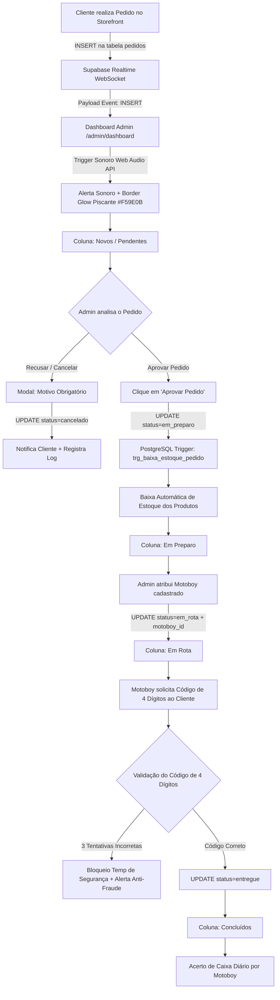
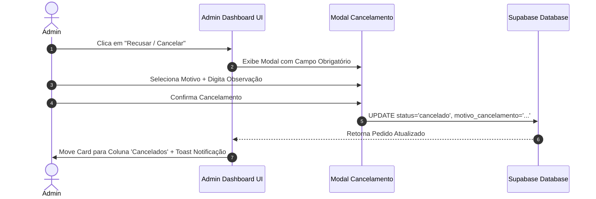

# 📄 SPEC-03-ADMIN-KANBAN: Especificação Técnica e Arquitetura do Painel Administrativo em Tempo Real

**Projeto:** TELES ADEGA DELIVERY  
**DDD / Região:** (13) - Baixada Santista  
**Contato Oficial:** WhatsApp (13) 99765-0605 | Instagram [@teles.adegadelivery](https://instagram.com/teles.adegadelivery)  
**Identidade Visual:** Dark Theme (`#0D0D0D`), Amarelo Ouro (`#F59E0B`), Verde WhatsApp (`#22C55E`), Vermelho Alerta (`#EF4444`), Azul Operacional (`#3B82F6`)  
**Stack Admin:** Next.js 14/15 (App Router), React 18+, Tailwind CSS, Supabase SSR/Auth (`@supabase/ssr`), Supabase Realtime WebSocket Subscriptions, Web Audio API / HTML5 Audio (Alertas Sonoros), Lucide React Icons  
**Autor:** Engenheiro de Software Sênior (Full-Stack & Real-Time Architect)  
**Versão:** 1.0.0  
**Data:** 11/08/2026  

---

## 1. Visão Geral & Arquitetura do Painel Administrativo

O **Painel Administrativo do TELES ADEGA DELIVERY** é o centro de controle operacional em tempo real da adega, construído para o proprietário e operadores gerenciarem o fluxo completo de pedidos, controle anti-fraude, expedição para entregadores (motoboys), gestão de estoque, controle de clientes e fechamento de caixa diário.

O sistema opera sobre uma arquitetura **Event-Driven e Reativa** através de conexões WebSocket persistentes via **Supabase Realtime**, garantindo latência inferior a 300ms entre a realização de um pedido no storefront pelo cliente e sua notificação no painel do administrador.

### 1.1 Guia de Tokens e Identidade Visual (Admin Dark Theme)

| Token / Variável | Valor Hex / CSS | Aplicação no Layout Admin |
| :--- | :--- | :--- |
| **`bg-background`** | `#0D0D0D` | Fundo principal da aplicação (Dark Puro) |
| **`bg-surface`** | `#161616` | Fundo de colunas Kanban, cards, modais e tabelas |
| **`bg-surface-hover`** | `#222222` | Estado hover de linhas de tabela e cards interativos |
| **`border-color`** | `#262626` | Divisores de coluna, bordas de cards e inputs |
| **`accent-yellow`** | `#F59E0B` | Cor primária da marca (Destaques, novos pedidos, bordas pendentes) |
| **`accent-yellow-hover`**| `#D97706` | Estado hover/active de botões principais de ação |
| **`brand-whatsapp`** | `#22C55E` | Botão de contato direto, pedidos concluídos e alertas de sucesso |
| **`status-info`** | `#3B82F6` | Pedidos em preparo, badges informativos de sistema |
| **`status-purple`** | `#8B5CF6` | Pedidos em rota de entrega / vinculados a motoboy |
| **`status-danger`** | `#EF4444` | Pedidos cancelados, alerta de estoque mínimo, fraude e erro |
| **`text-primary`** | `#FFFFFF` | Títulos de colunas, nomes de clientes, totais em dinheiro |
| **`text-secondary`** | `#A1A1AA` | Detalhes de itens, horários, telefones, bairros |
| **`text-muted`** | `#71717A` | Labels secundárias, logs de sistema e marcas d'água |

---

### 1.2 Diagrama do Fluxo Operacional Admin & Kanban (Mermaid)



---

## 2. Autenticação & Proteção de Rotas (`/admin/login` e `middleware.ts`)

### 2.1 Fluxo de Autenticação (`/admin/login`)

A autenticação do administrador é realizada via **Supabase Auth** com credenciais de e-mail e senha. O painel não possui auto-cadastro público (sign-up desabilitado para rotas públicas).

- **Formulário de Login (`src/app/admin/login/page.tsx`):**
  - Campos: E-mail (`type="email"`) e Senha (`type="password"`).
  - Validação Client-Side com Zod schema.
  - Chamada ao método `supabase.auth.signInWithPassword({ email, password })`.
  - Em caso de sucesso: Redirecionamento automático para `/admin/dashboard` com cookie de sessão seguro (`sb-access-token` e `sb-refresh-token`).
  - Em caso de erro: Exibição de toast de alerta ("Credenciais inválidas ou acesso não autorizado").

---

### 2.2 Middleware de Segurança (`src/middleware.ts`)

O Next.js Middleware atua na camada Edge para interceptar todas as requisições direcionadas ao prefixo `/admin/*` antes da renderização de qualquer página.

```typescript
// Exemplificação da arquitetura do middleware de proteção
import { createServerClient, type CookieOptions } from '@supabase/ssr'
import { NextResponse, type NextRequest } from 'next/server'

export async function middleware(request: NextRequest) {
  let response = NextResponse.next({
    request: {
      headers: request.headers,
    },
  })

  const supabase = createServerClient(
    process.env.NEXT_PUBLIC_SUPABASE_URL!,
    process.env.NEXT_PUBLIC_SUPABASE_ANON_KEY!,
    {
      cookies: {
        get(name: string) {
          return request.cookies.get(name)?.value
        },
        set(name: string, value: string, options: CookieOptions) {
          request.cookies.set({ name, value, ...options })
          response = NextResponse.next({
            request: { headers: request.headers },
          })
          response.cookies.set({ name, value, ...options })
        },
        remove(name: string, options: CookieOptions) {
          request.cookies.set({ name, value, ...options, maxAge: 0 })
          response = NextResponse.next({
            request: { headers: request.headers },
          })
          response.cookies.set({ name, value, ...options, maxAge: 0 })
        },
      },
    }
  )

  const { data: { session } } = await supabase.auth.getSession()
  const isAdminRoute = request.nextUrl.pathname.startsWith('/admin')
  const isLoginPage = request.nextUrl.pathname === '/admin/login'

  // Impede acesso não autenticado a rotas protegidas
  if (isAdminRoute && !isLoginPage && !session) {
    return NextResponse.redirect(new URL('/admin/login', request.url))
  }

  // Redireciona usuário autenticado que tentar acessar a página de login
  if (isLoginPage && session) {
    return NextResponse.redirect(new URL('/admin/dashboard', request.url))
  }

  return response
}

export const config = {
  matcher: ['/admin/:path*'],
}
```

---

## 3. Dashboard Kanban de Pedidos em Tempo Real (`/admin/dashboard`)

### 3.1 Arquitetura Supabase Realtime (WebSocket Subscriptions)

O Kanban do Dashboard se conecta diretamente ao canal PostgreSQL do Supabase para receber atualizações sem necessidade de refresh manual de página (Zero Polling).

```typescript
// Hook customizado para escutar eventos em tempo real
import { useEffect } from 'react'
import { supabase } from '@/services/supabaseClient'

export function useRealtimeOrders(onNewOrder: (order: any) => void, onUpdateOrder: (order: any) => void) {
  useEffect(() => {
    const channel = supabase
      .channel('admin-kanban-orders')
      .on(
        'postgres_changes',
        {
          event: 'INSERT',
          schema: 'public',
          table: 'pedidos',
        },
        (payload) => {
          onNewOrder(payload.new)
        }
      )
      .on(
        'postgres_changes',
        {
          event: 'UPDATE',
          schema: 'public',
          table: 'pedidos',
        },
        (payload) => {
          onUpdateOrder(payload.new)
        }
      )
      .subscribe()

    return () => {
      supabase.removeChannel(channel)
    }
  }, [onNewOrder, onUpdateOrder])
}
```

---

### 3.2 Sistema de Alertas Visuais & Sonoros

Para evitar que a adega perca pedidos em horários de pico, o painel possui um duplo sistema de notificação quando um pedido entra com status `pendente_aprovacao` ou `aguardando_pagamento`:

1. **Alerta Sonoro (Web Audio API / HTML5 Audio):**
   - Executa um arquivo de som de alta prioridade (`/sounds/new-order-bell.mp3`) em loop de 5 segundos até que o operador interaja com o pedido.
   - Possui botão de desativação manual (Mute/Unmute) no cabeçalho do Kanban.
   - Respeita a política de Autoplay dos navegadores através de um handler de inicialização na primeira interação do operador no painel ("Ativar Sons de Notificação").

2. **Alerta Visual Piscante (`animate-pulse` & Border Glow):**
   - O Card do pedido e o cabeçalho da coluna `Novos / Pendentes` piscam com uma borda amarela brilhante (`#F59E0B`) e efeito `shadow-[0_0_15px_rgba(245,158,11,0.5)]`.
   - Badge vibrante indicando o tempo decorrido desde a criação do pedido (ex: `"Há 2 min"`).

---

### 3.3 Estrutura das Colunas do Kanban

O painel organiza os pedidos em 5 colunas horizontais com suporte a rolagem independente:

```text
┌──────────────────┐ ┌──────────────────┐ ┌──────────────────┐ ┌──────────────────┐ ┌──────────────────┐
│  1. NOVOS /      │ │  2. EM PREPARO   │ │   3. EM ROTA     │ │  4. CONCLUÍDOS   │ │  5. CANCELADOS   │
│     PENDENTES    │ │                  │ │                  │ │                  │ │                  │
│ [pendente_       │ │ [em_preparo]     │ │ [em_rota]        │ │ [entregue]       │ │ [cancelado]      │
│  aprovacao]      │ │                  │ │                  │ │                  │ │                  │
│ [aguardando_     │ │ (Estoque já      │ │ (Vinculado a     │ │ (Código 4 dig    │ │ (Possui motivo   │
│  pagamento]      │ │  debitado via    │ │  Motoboy)        │ │  validado)       │ │  registrado)     │
│                  │ │  trigger)        │ │                  │ │                  │ │                  │
└──────────────────┘ └──────────────────┘ └──────────────────┘ └──────────────────┘ └──────────────────┘
```

| Coluna | Status Mapeados (`PEDIDOS.status`) | Ações Permitidas | Cor Temática |
| :--- | :--- | :--- | :--- |
| **1. Novos / Pendentes** | `pendente_aprovacao`, `aguardando_pagamento` | - **Aprovar Pedido** (Move p/ Em Preparo)<br>- **Recusar Pedido** (Abre modal de motivo) | `#F59E0B` (Amarelo Pulsante) |
| **2. Em Preparo** | `em_preparo` | - **Atribuir Motoboy**<br>- **Despachar** (Move p/ Em Rota) | `#3B82F6` (Azul) |
| **3. Em Rota** | `em_rota` | - **Validar Código 4 Dígitos**<br>- **Finalizar Entrega** (Move p/ Concluído) | `#8B5CF6` (Roxo) |
| **4. Concluídos** | `entregue` | - Visualizar detalhes do pedido<br>- Reemitir comprovante | `#22C55E` (Verde WhatsApp) |
| **5. Cancelados** | `cancelado` | - Visualizar motivo do cancelamento<br>- Histórico do cliente | `#EF4444` (Vermelho) |

---

### 3.4 Componente: Card do Pedido Kanban (`KanbanOrderCard.tsx`)

O Card exibe resumidamente todas as informações essenciais para tomada de decisão em menos de 3 segundos:

```tsx
// Interface simplificada dos props do Card
interface KanbanOrderCardProps {
  pedido: {
    id: string
    numero_pedido: number
    cliente_nome: string
    cliente_whatsapp: string
    bairro: string
    endereco_completo: string
    forma_pagamento: 'pix' | 'dinheiro' | 'fiado'
    valor_troco?: number
    valor_total: number
    codigo_entrega: string
    status: string
    criado_em: string
    itens: Array<{
      quantidade: number
      produto_nome: string
      subtotal: number
    }>
  }
  onAprovar: (id: string) => void
  onRecusar: (id: string) => void
  onAtribuirMotoboy: (id: string, motoboyId: string) => void
  onValidarCodigo: (id: string, codigo: string) => void
}
```

**Anatomia do Card no Layout Admin:**
- **Cabeçalho do Card:** Número do Pedido (`#1042`), Timer de espera decorrido e Badge com Forma de Pagamento (`Pix`, `Dinheiro (Troco p/ R$ 50)`, `Fiado`).
- **Corpo:** Nome do Cliente, Link direto para abrir conversa no WhatsApp com 1 clique, Endereço de Entrega resumido (Bairro + Rua).
- **Lista de Itens (Compacta):**
  - `2x Cerveja Heineken 350ml (GELADA)`
  - `1x Whisky Red Label 1L`
  - `1x Gelo de Coco 200g`
- **Rodapé do Card:** Valor Total em Destaque (`R$ 148,90`) + Botões de Ação Rápida contextualizados ao status atual.

---

## 4. Trava Anti-Fraude & Aprovação Manual de Pedidos

### 4.1 Fluxo de Aprovação Manual ("Aprovar Pedido")

A aprovação manual é o ponto de checagem obrigatório para garantir que comprovantes Pix falsos ou pedidos maliciosos não entrem na esteira de produção.

1. **Ação do Operador:** O operador clica no botão verde **"Aprovar Pedido"**.
2. **Atualização no Banco de Dados:** O sistema executa um `UPDATE public.pedidos SET status = 'em_preparo' WHERE id = :pedido_id`.
3. **Disparo Automático de Trigger (`trg_baixa_estoque_pedido`):**
   - O banco de dados PostgreSQL intercepta a alteração de status para `em_preparo`.
   - Para cada item presente em `itens_pedido`, a trigger reduz a quantidade correspondente em `PRODUTOS.estoque_atual`.
   - Se o estoque de algum item for insuficiente para suprir o pedido, a transação é abortada com exceção `RAISE EXCEPTION 'Estoque insuficiente'`, o pedido retorna ao estado pendente e um alerta toast é exibido ao admin.

---

### 4.2 Fluxo de Recusa / Cancelamento com Motivo Obrigatório

Para manter a rastreabilidade e evitar cancelamentos arbitrários, o cancelamento exige justificativa registrada.



**Motivos Pré-cadastrados (Dropdown):**
- Comprovante Pix não identificado ou divergente.
- Endereço fora da área de cobertura de entrega.
- Cliente solicitou o cancelamento via WhatsApp.
- Produto esgotado / indisponível no momento.
- Tentativa de fraude ou dados inconsistentes.

---

## 5. Módulo de Entrega, Motoboy & Fechamento de Caixa (`/admin/entregas`)

### 5.1 Atribuição de Pedidos a Motoboys

Na tela de entregas ou diretamente no Card da coluna `Em Preparo`, o administrador seleciona um dos entregadores ativos cadastrados na tabela `MOTOBOYS`.

- Ao atribuir o motoboy:
  - `UPDATE public.pedidos SET status = 'em_rota', motoboy_id = :motoboy_id WHERE id = :pedido_id`.
  - O pedido transiciona imediatamente para a coluna **"Em Rota"**.

---

### 5.2 Validação do Código de 4 Dígitos na Entrega

Para prevenir que o pedido seja entregue à pessoa errada ou sofrer extravio, a conclusão da entrega exige a digitação do código de segurança de 4 dígitos gerado durante o checkout.

```typescript
// Especificação da função RPC de validação de código de entrega
export async function validarCodigoEntrega(pedidoId: string, codigoInformado: string) {
  const { data, error } = await supabase.rpc('validar_codigo_pedido', {
    p_pedido_id: pedidoId,
    p_codigo_informado: codigoInformado,
  })

  if (error) throw new Error(error.message)
  return data // { sucesso: boolean, tentativas_restantes: number, bloqueado: boolean }
}
```

**Regra de Trava Anti-Fraude de 3 Tentativas:**
- O sistema mantém um contador de tentativas no estado do pedido ou em memória/cache (`tentativas_codigo_falhas`).
- Se o operador/motoboy errar o código 3 vezes consecutivas:
  - O campo de validação é **bloqueado temporariamente por 15 minutos**.
  - É exibido um badge de **"Suspeita de Fraude / Código Incorreto Excedido"**.
  - É gerado um alerta no topo do painel para o proprietário entrar em contato com o cliente via WhatsApp oficial para confirmar a identidade.

---

### 5.3 Módulo de Fechamento de Caixa Diário por Motoboy

No encerramento do turno ou dia operacional, o administrador realiza o **Acerto de Caixa** individualizado por entregador na rota `/admin/entregas/caixa`.

**Resumo de Prestação de Contas por Motoboy:**
1. **Total de Entregas Realizadas:** Quantidade de pedidos com status `entregue` no dia.
2. **Valores em Dinheiro (Cash collected):** Soma total que o motoboy recebeu fisicamente em cédulas dos clientes. *(Este é o valor exato que o motoboy deve entregar fisicamente ao caixa da adega)*.
3. **Valores em Pix (Paid online/direct):** Soma dos pedidos pagos via Pix (já entraram na conta bancária da adega).
4. **Valores em Fiado (Credit):** Soma dos pedidos lançados na conta fiado dos clientes.

```text
┌───────────────────────────────────────────────────────────────────────────┐
│ FECHAMENTO DE CAIXA DIÁRIO - MOTOBOY: CARLOS SILVA                       │
│ Data: 11/08/2026 | Período: Turno Noite                                   │
├───────────────────────────────────────────────────────────────────────────┤
│ • Entregas Concluídas: 14 pedidos                                         │
│ • Total Faturado nas Entregas: R$ 1.240,00                                │
│                                                                           │
│ DESCRIMINAÇÃO POR FORMA DE PAGAMENTO:                                    │
│ ├─ Dinheiro (Recebido pelo Motoboy): .......... R$ 450,00  [ENTREGAR CAIXA] │
│ ├─ Pix (Direto na Conta da Adega): ........... R$ 690,00  [CONFIRMADO]    │
│ └─ Fiado (Lançado na Conta do Cliente): ...... R$ 100,00  [DEBITADO]      │
├───────────────────────────────────────────────────────────────────────────┤
│ [ AÇÃO: CONFIRMAR ACERTO E DAR BAIXA NO CAIXA DO MOTOBOY ]                │
└───────────────────────────────────────────────────────────────────────────┘
```

Ao confirmar o acerto, o sistema registra uma nova movimentação financeira na tabela `MOVIMENTACOES_CAIXA` com tipo `entrada_caixa_motoboy` e atualiza o status das entregas do dia para `caixa_fechado`.

---

## 6. Módulos de Gestão (CRUDs Administrativos)

### 6.1 Gestão de Produtos (`/admin/produtos`)

Interface para controle completo do catálogo da adega com edição em tempo real.

- **Tabela / Grid de Produtos (`src/app/admin/produtos/page.tsx`):**
  - Colunas: Foto, Nome do Produto, Categoria, Preço (R$), Estoque Atual, Estoque Mínimo, Status (Ativo/Inativo), Ações.
  - Filtros rápidos: Por Categoria, Apenas Alerta de Estoque Mínimo, Busca por Nome.

- **Ajuste de Estoque & Alerta de Estoque Mínimo:**
  - Se `estoque_atual <= estoque_minimo`, a linha do produto exibe uma badge amarela/vermelha piscante (`"Estoque Crítico: X unidades"`).
  - Modal de ajuste rápido de quantidade (+ / - estoque com registro de motivo: compra de fornecedor, quebra, avaria).

- **Upload de Fotos via Supabase Storage:**
  - Upload de imagens diretamente para o bucket público `produtos`.
  - Compressão client-side da imagem para formato WebP (máximo 800x800px, 85% qualidade) antes do envio.
  - Atualização automática do campo `PRODUTOS.foto_url` com a URL pública gerada pelo Supabase Storage CDN.

---

### 6.2 Gestão de Clientes e Fiado (`/admin/clientes`)

Módulo essencial para controle de vendas fiado (crédito local), acompanhamento de histórico e recebimentos.

- **Lista de Clientes (`src/app/admin/clientes/page.tsx`):**
  - Tabela responsiva com busca por Nome, WhatsApp e CEP.
  - Indicador visual do **Saldo Fiado Atual** vs **Limite de Crédito Fiado**.

- **Prontuário e Histórico do Cliente:**
  - Modal/Drawer com todo o histórico de compras do cliente, entregas efetuadas, cancelamentos e pagamentos fiado anteriores.

- **Ajuste de Limite de Crédito Fiado:**
  - O administrador pode alterar o `limite_fiado` individualmente por cliente (Padrão inicial de cadastro: R$ 300,00).

- **Módulo de Abatimento / Recebimento de Fiado ("Dar Baixa em Fiado"):**
  - Quando o cliente vai à adega ou faz um Pix para pagar a dívida fiado:
    1. Admin clica em **"Dar Baixa em Fiado"**.
    2. Digita o valor recebido (ex: `R$ 150,00`).
    3. Seleciona a forma de pagamento do recebimento (Dinheiro ou Pix).
    4. O sistema executa um `UPDATE CLIENTES SET saldo_fiado_atual = saldo_fiado_atual - :valor_pago`.
    5. É gerada uma entrada na tabela `MOVIMENTACOES_CAIXA` categorizada como `recebimento_fiado`.

---

## 7. Estrutura de Pastas e Roteamento (Next.js App Router - Admin)

A organização de arquivos do módulo administrativo respeita a modularização e reutilização de componentes:

```text
src/
├── app/
│   └── admin/
│       ├── layout.tsx                     # Layout mestre do admin (Sidebar, Topbar, Auth Context)
│       ├── login/
│       │   └── page.tsx                   # /admin/login (Autenticação via Supabase Auth)
│       ├── dashboard/
│       │   └── page.tsx                   # /admin/dashboard (Kanban em Tempo Real)
│       ├── entregas/
│       │   ├── page.tsx                   # /admin/entregas (Atribuição de Motoboys e Validação)
│       │   └── caixa/
│       │       └── page.tsx               # /admin/entregas/caixa (Acerto de Caixa Diário)
│       ├── produtos/
│       │   └── page.tsx                   # /admin/produtos (CRUD de Produtos + Upload Storage)
│       └── clientes/
│           └── page.tsx                   # /admin/clientes (Prontuário de Clientes e Gestão Fiado)
├── components/
│   └── admin/
│       ├── layout/
│       │   ├── AdminSidebar.tsx           # Navegação lateral com links e estatísticas rápidas
│       │   ├── AdminHeader.tsx            # Cabeçalho com dados do usuário, mute som e logout
│       │   └── SoundNotificationToggle.tsx# Toggle de ativação da Web Audio API
│       ├── kanban/
│       │   ├── KanbanBoard.tsx            # Container principal do Kanban (5 Colunas)
│       │   ├── KanbanColumn.tsx           # Coluna individual com contador de pedidos
│       │   ├── KanbanOrderCard.tsx        # Card detalhado do pedido com ações rápidas
│       │   └── OrderCancelModal.tsx       # Modal com justificativa obrigatória de cancelamento
│       ├── entregas/
│       │   ├── MotoboyAssignSelector.tsx  # Seletor modal para atribuir entregador
│       │   ├── CodeValidationInput.tsx    # Campo de input do código de 4 dígitos com trava
│       │   └── MotoboyCashReportModal.tsx # Extrato e recibo de fechamento de caixa do motoboy
│       ├── produtos/
│       │   ├── ProductFormModal.tsx       # Formulário de criação/edição de produto
│       │   ├── ProductImageUploader.tsx   # Componente de upload com preview e drag & drop
│       │   └── StockAdjustmentModal.tsx   # Ajuste rápido de estoque atual e estoque mínimo
│       └── clientes/
│           ├── ClientFiadoDrawer.tsx      # Histórico completo do cliente e ajuste de limite
│           └── FiadoPaymentModal.tsx      # Form para dar baixa em dívida fiado
├── hooks/
│   ├── useAdminAuth.ts                    # Hook de estado de autenticação e sessão do Admin
│   ├── useRealtimeOrders.ts               # Hook de inscrição no Supabase Realtime WebSocket
│   └── useAudioAlert.ts                   # Hook de controle do alerta sonoro (HTML5 Audio)
└── services/
    ├── adminServices.ts                   # Queries e Mutations específicas do Admin
    └── storageService.ts                  # Métodos de upload e remoção no Supabase Storage
```

---

## 8. Definição de Pronto (Definition of Done - DoD)

Para considerar a especificação técnica do Painel Administrativo concluída e pronta para a fase de implementação, o documento deve atender 100% aos critérios do checklist abaixo:

- [x] **Autenticação & Proteção:** Rota `/admin/login` especificada com Supabase Auth e Middleware de Edge `src/middleware.ts` bloqueando acessos não autorizados.
- [x] **Arquitetura Realtime:** Inscrição em WebSocket `postgres_changes` na tabela `pedidos` documentada com hooks e manipulação otimista de estado.
- [x] **Sistema de Alertas:** Duplo alerta (Audio Web API + Alerta piscante visual `#F59E0B`) definido com tratamento para política de autoplay de navegadores.
- [x] **Estrutura Kanban:** 5 colunas operacionais mapeadas (`Novos/Pendentes`, `Em Preparo`, `Em Rota`, `Concluídos`, `Cancelados`) com detalhamento completo dos dados exibidos no Card.
- [x] **Trava Anti-Fraude:** Botão de aprovação manual conectado à trigger PostgreSQL `trg_baixa_estoque_pedido` e cancelamento com modal de motivo obrigatório.
- [x] **Módulo de Entrega & Motoboy:** Fluxo de atribuição de pedidos, validação de código de 4 dígitos com bloqueio após 3 tentativas incorretas e acerto de caixa diário por motoboy discriminado por forma de pagamento.
- [x] **Gestão de Produtos:** Edição de preços, estoque atual/mínimo, alertas visuais de estoque baixo e upload de fotos no Supabase Storage bucket `produtos`.
- [x] **Gestão de Clientes & Fiado:** Visualização de histórico de pedidos, ajuste de limite de fiado e modal de abatimento/recebimento de débitos com registro em caixa.
- [x] **Arquitetura de Código:** Árvore de diretórios Clean Architecture no Next.js App Router especificada em detalhes.
