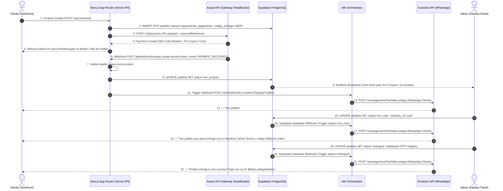
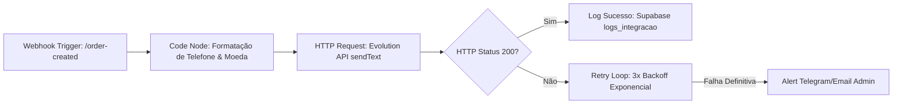
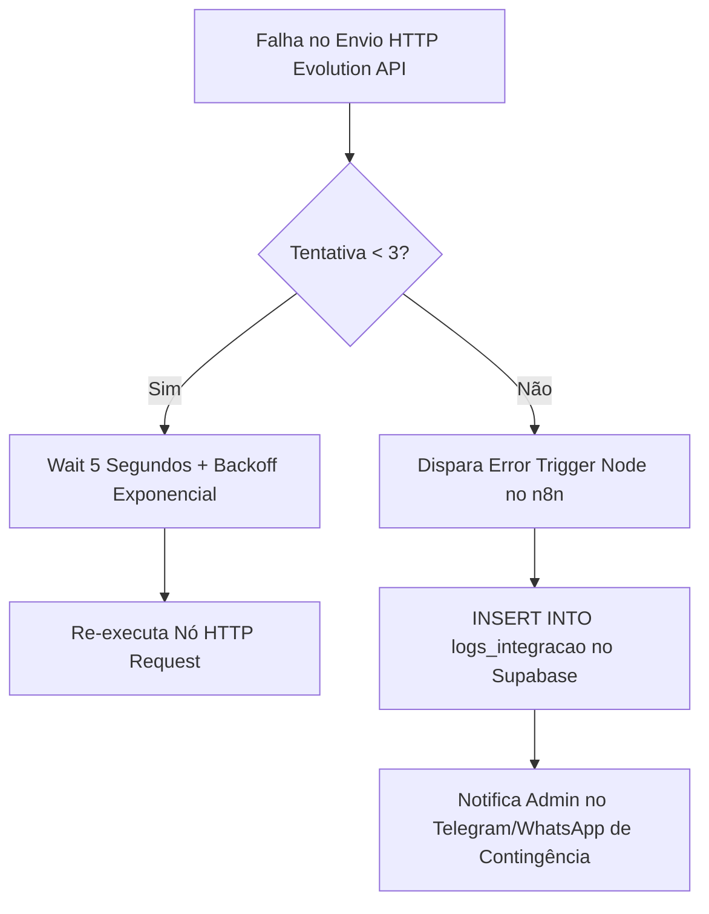

# 📄 SPEC-04-INTEGRATIONS-N8N: Especificação Técnica de Automações, Pagamentos Pix (Mercado Pago) e WhatsApp (n8n + Evolution API)

**Projeto:** TELES ADEGA DELIVERY  
**DDD / Região:** (13) - Baixada Santista  
**Contato / WhatsApp Oficial:** (13) 99765-0605 | Instagram [@teles.adegadelivery](https://instagram.com/teles.adegadelivery)  
**Stack de Integrações:** Next.js 14/15 (App Router), Supabase (Database, Auth, Database Webhooks), Mercado Pago API v1 (Pix Payments & Webhooks), n8n (Self-hosted Workflow Orchestrator), Evolution API v2 (WhatsApp Baileys Gateway), Node.js Crypto (HMAC SHA256), Zod Validation  
**Autor:** Engenheiro de Software Sênior (Backend, Payments & Automations Specialist)  
**Versão:** 1.0.0  
**Data:** 11/08/2026  

---

## 1. Arquitetura Geral de Integração & Webhooks

O ecossistema de automações e pagamentos do **TELES ADEGA DELIVERY** une o processamento financeiro instantâneo em tempo real via **Mercado Pago API (Pix)** com o disparo reativo e assíncrono de notificações de pedido via **WhatsApp**, utilizando o **n8n (Self-hosted)** e a **Evolution API (v2 / Engine Baileys)**.

### 1.1 Princípios de Arquitetura & Resiliência

1. **Idempotência Operacional:** Todas as transações financeiras e requisições de webhook carregam chave de idempotência (`X-Idempotency-Key`) para prevenir duplicidade de cobrança em repetições de requisições de rede.
2. **Zero Confiança em Webhooks Recebidos (Anti-Spoofing):** Webhooks recebidos do gateway de pagamento **nunca** alteram o estado do banco de dados baseando-se apenas no payload recebido. O Next.js valida o cabeçalho criptográfico `x-signature` e realiza uma **Consulta Ativa de Confirmação (GET /v1/payments/{id})** diretamente na API oficial do Mercado Pago antes de atualizar o pedido.
3. **Desacoplamento Assíncrono:** O servidor Web (Next.js) responde aos webhooks e finalizações de pedido em tempo hábil (< 200ms) e delega o processamento de notificações ao **n8n** através de chamadas HTTP não-bloqueantes ou Database Webhooks do Supabase.
4. **Retry Ativo & Redundância:** Caso a Evolution API ou o WhatsApp apresentem instabilidade, o n8n executa política de tentativas (`Retry on Fail`: 3 tentativas com backoff exponencial) e registra logs de erro no Supabase (`logs_integracao`).

---

### 1.2 Diagrama Completo de Comunicação Reativa (Mermaid)



---

### 1.3 Mapeamento de Credenciais e Variáveis de Ambiente (`.env.production`)

```env
# Asaas Credentials & Gateway Simplificado
ASAAS_API_KEY="$aact_prod_xxxxxx..."
ASAAS_ENVIRONMENT="sandbox" # ou "production"
ASAAS_WEBHOOK_TOKEN="asaas_sec_teles_adega_997650605_x89"

# Storefront & Webhook URLs
NEXT_PUBLIC_APP_URL="https://adegateles.com.br"
ASAAS_WEBHOOK_URL="https://adegateles.com.br/api/webhooks/asaas"

# n8n Automation Engine Credentials
N8N_BASE_URL="https://n8n.adegateles.com.br"
N8N_WEBHOOK_SECRET_TOKEN="n8n_sec_teles_adega_997650605_x89z"

# Evolution API / WhatsApp Engine
EVOLUTION_API_BASE_URL="https://wa.adegateles.com.br"
EVOLUTION_API_KEY="evo_key_teles_adega_prod_88123"
EVOLUTION_INSTANCE_NAME="teles-adega"
OFFICIAL_WHATSAPP_NUMBER="5513997650605"
```

---

## 2. Geração de Cobrança Pix & Webhooks (Gateway Simplificado Asaas)

### 2.1 Endpoint e Payload de Criação de Pagamento Pix (Asaas API v3)

Para gerar uma cobrança Pix no checkout, o backend Next.js consome o endpoint oficial de pagamentos do Asaas (`/v3/payments`).

- **Endpoint:** `POST https://api-sandbox.asaas.com/v3/payments` (Sandbox) / `https://api.asaas.com/v3/payments` (Produção)
- **Headers HTTP:**
  - `Content-Type: application/json`
  - `User-Agent: TelesAdegaDelivery/1.0`
  - `access_token: {ASAAS_API_KEY}`

#### Payload de Requisição (JSON enviada pelo Next.js ao Asaas):

```json
{
  "customer": "cus_000005017596",
  "billingType": "PIX",
  "value": 142.90,
  "dueDate": "2026-09-25",
  "description": "Pedido #b8a21f45 - Teles Adega Delivery",
  "externalReference": "b8a21f45-0912-4c28-98e1-5120a1c78ef4",
  "postalService": false
}
```

---

### 2.2 Extração do Pix QR Code e Copia e Cola

Após a criação da cobrança, o backend faz a requisição:
- **Endpoint:** `GET /v3/payments/{paymentId}/pixQrCode`

#### Payload de Resposta (Asaas):

```json
{
  "encodedImage": "iVBORw0KGgoAAA...",
  "payload": "00020126580014br.gov.bcb.pix0136b8a21f45-0912-4c28-98e1-5120a1c78ef4...",
  "expirationDate": "2026-09-25 23:59:59"
}
```

---

### 2.3 Webhook de Confirmação de Pagamento (`POST /api/webhooks/asaas`)

Quando o cliente conclui a transferência Pix no app bancário, o Asaas envia uma notificação `POST` para o webhook do Teles Adega Delivery.

#### Validação de Segurança via Header `asaas-access-token`

O Asaas envia o token de autenticação configurado no painel através do header `asaas-access-token`. O Next.js valida este cabeçalho contra a variável `ASAAS_WEBHOOK_TOKEN`.

#### Payload de Evento Recebido do Asaas:

```json
{
  "id": "evt_05b708f961d739ea7eba7e4db318f621",
  "event": "PAYMENT_RECEIVED",
  "dateCreated": "2026-09-24 02:50:00",
  "payment": {
    "id": "pay_642487216120",
    "customer": "cus_000005017596",
    "value": 142.90,
    "status": "RECEIVED",
    "billingType": "PIX",
    "externalReference": "b8a21f45-0912-4c28-98e1-5120a1c78ef4"
  }
}
```

Ao receber `PAYMENT_RECEIVED` ou `PAYMENT_CONFIRMED`:
1. Identifica o `pedidoId` pelo `externalReference`.
2. Atualiza o status do pedido no Supabase para `'em_preparo'` (marcando como Pago e liberando separação).
3. O Supabase Realtime propaga a mudança instantaneamente para a tela do cliente e para o Kanban do Atendente.
4. Notifica o n8n para disparo do WhatsApp oficial.

      // 4. Disparo do Webhook para o n8n iniciar o Workflow 1 (Confirmação de Pedido)
      try {
        await fetch(`${process.env.N8N_BASE_URL}/webhook/order-created`, {
          method: 'POST',
          headers: {
            'Content-Type': 'application/json',
            'x-n8n-token': process.env.N8N_WEBHOOK_SECRET_TOKEN!
          },
          body: JSON.stringify({
            event: 'order_created',
            pedido: {
              id: pedido.id,
              numero_pedido: pedido.numero_pedido,
              cliente_nome: pedido.cliente_nome,
              cliente_telefone: pedido.cliente_telefone,
              valor_total: pedido.valor_total,
              codigo_confirmacao: pedido.codigo_confirmacao,
              status_pagamento: 'pago',
              metodo_pagamento: 'pix'
            }
          })
        })
      } catch (n8nErr) {
        console.error('[Webhook MercadoPago] Erro ao notificar n8n:', n8nErr)
        // Não falha o webhook do Mercado Pago se o n8n falhar (tolerância a falhas)
      }
    }

    return NextResponse.json({ success: true, paymentId, mpStatus }, { status: 200 })

  } catch (error: any) {
    console.error('[Webhook MercadoPago] Exceção não tratada:', error)
    return NextResponse.json({ error: error.message || 'Internal Server Error' }, { status: 500 })
  }
}
```

---

## 3. Workflows no n8n (Automações do WhatsApp via Evolution API)

### 3.1 Arquitetura do n8n & Endpoint da Evolution API

O **n8n** (Self-hosted) gerencia os fluxos de mensagens para o WhatsApp conectado à instância `teles-adega` na **Evolution API v2**.

- **URL de Disparo Evolution API:** `POST {EVOLUTION_API_BASE_URL}/message/sendText/{EVOLUTION_INSTANCE_NAME}`
- **Headers HTTP Obrigatórios:**
  - `Content-Type: application/json`
  - `apikey: {EVOLUTION_API_KEY}`

#### Estrutura do Payload Padrão de Envio (Evolution API):

```json
{
  "number": "5513998877665",
  "text": "Mensagem formatada com *negrito*, _itálico_ e quebras de linha.\n\nTeles Adega Delivery 🍷",
  "options": {
    "delay": 1200,
    "presence": "composing",
    "linkPreview": true
  }
}
```

---

### 3.2 Workflow 1: Confirmação de Pedido Realizado (`order-created`)

Este fluxo é acionado quando o pedido é registrado e confirmado no sistema (após pagamento Pix aprovado ou confirmação de pagamento na entrega).

- **Gatilho (Trigger):** Webhook n8n `POST /webhook/order-created`
- **Objetivo:** Notificar o cliente sobre o recebimento do pedido, resumo de valores e o **Código de Confirmação de 4 dígitos** essencial para a entrega.

#### Template da Mensagem WhatsApp (Workflow 1):

```text
🍷 *TELES ADEGA DELIVERY* 🍷
-----------------------------------------
Olá, *{{ $json.pedido.cliente_nome }}*! 👋

Recebemos o seu pedido *#{{ $json.pedido.numero_pedido }}* com sucesso! 🚀

📋 *Resumo do Pedido:*
• Valor Total: *R$ {{ $json.pedido.valor_total.toFixed(2).replace('.', ',') }}*
• Pagamento: *{{ $json.pedido.metodo_pagamento.toUpperCase() }}*
• Status: *Em Preparo*

🔐 *CÓDIGO DE SEGURANÇA PARA ENTREGA:*
👉 *{{ $json.pedido.codigo_confirmacao }}* 👈

⚠️ *Guarde este código!* Você precisará informá-lo ao motoboy no momento da entrega para liberar seus produtos.

Já estamos gelando e preparando suas bebidas! Qualquer dúvida, responda a esta mensagem.
```

#### Diagrama de Nós no n8n (Workflow 1 JSON Logic):



#### Especificação de Configuração dos Nós do Workflow 1 (n8n JSON Snippet):

```json
{
  "nodes": [
    {
      "parameters": {
        "httpMethod": "POST",
        "path": "order-created",
        "options": {
          "rawBody": false
        }
      },
      "name": "Webhook Order Created",
      "type": "n8n-nodes-base.webhook",
      "typeVersion": 1,
      "position": [250, 300]
    },
    {
      "parameters": {
        "jsCode": "const input = $input.first().json.body;\nconst rawPhone = String(input.pedido.cliente_telefone).replace(/\\D/g, '');\nconst formattedPhone = rawPhone.startsWith('55') ? rawPhone : '55' + rawPhone;\nconst formattedTotal = Number(input.pedido.valor_total).toLocaleString('pt-BR', { style: 'currency', currency: 'BRL' });\n\nreturn {\n  phone: formattedPhone,\n  nome: input.pedido.cliente_nome,\n  numeroPedido: input.pedido.numero_pedido,\n  valorTotal: formattedTotal,\n  codigoConfirmacao: input.pedido.codigo_confirmacao,\n  metodoPagamento: input.pedido.metodo_pagamento\n};"
      },
      "name": "Format Data & Phone",
      "type": "n8n-nodes-base.code",
      "typeVersion": 2,
      "position": [450, 300]
    },
    {
      "parameters": {
        "method": "POST",
        "url": "={{ $env.EVOLUTION_API_BASE_URL }}/message/sendText/{{ $env.EVOLUTION_INSTANCE_NAME }}",
        "sendHeaders": true,
        "headerParameters": {
          "parameters": [
            {
              "name": "apikey",
              "value": "={{ $env.EVOLUTION_API_KEY }}"
            },
            {
              "name": "Content-Type",
              "value": "application/json"
            }
          ]
        },
        "sendBody": true,
        "specifyBody": "json",
        "jsonBody": "={\n  \"number\": \"{{ $json.phone }}\",\n  \"text\": \"🍷 *TELES ADEGA DELIVERY* 🍷\\n-----------------------------------------\\nOlá, *{{ $json.nome }}*! 👋\\n\\nRecebemos o seu pedido *#{{ $json.numeroPedido }}* com sucesso! 🚀\\n\\n📋 *Resumo do Pedido:*\\n• Valor Total: *{{ $json.valorTotal }}*\\n• Status: *Em Preparo*\\n\\n🔐 *CÓDIGO DE SEGURANÇA PARA ENTREGA:*\\n👉 *{{ $json.codigoConfirmacao }}* 👈\\n\\n⚠️ *Guarde este código!* Você precisará informá-lo ao motoboy no momento em que ele chegar.\"\n}"
      },
      "name": "Send WhatsApp Message",
      "type": "n8n-nodes-base.httpRequest",
      "typeVersion": 4.1,
      "position": [680, 300]
    }
  ]
}
```

---

### 3.3 Workflow 2: Pedido Saiu para Entrega (`order-dispatch`)

Este fluxo é ativado automaticamente via **Database Webhook do Supabase** quando um operador altera o status do pedido para `em_rota` no Kanban do Painel Admin.

- **Gatilho (Trigger):** Webhook n8n `POST /webhook/order-dispatch`
- **Payload Recebido:** `pedido_id`, `numero_pedido`, `cliente_nome`, `cliente_telefone`, `motoboy_nome`, `motoboy_telefone`, `codigo_confirmacao`.

#### Template da Mensagem WhatsApp (Workflow 2):

```text
🛵 *SEU PEDIDO SAIU PARA ENTREGA!* 🛵
-----------------------------------------
Olá, *{{ $json.pedido.cliente_nome }}*! ⚡

O seu pedido *#{{ $json.pedido.numero_pedido }}* acabou de sair da Teles Adega e já está a caminho do seu endereço!

🏍️ *Entregador:* {{ $json.pedido.motoboy_nome }}
📞 *Contato Motoboy:* {{ $json.pedido.motoboy_telefone }}

🔑 *RELEMBRANDO SEU CÓDIGO DE 4 DÍGITOS:*
👉 *{{ $json.pedido.codigo_confirmacao }}* 👈

Por favor, esteja com o celular por perto e o código em mãos para agilizar a entrega do seu pedido trincando de gelado! 🧊🍻
```

---

### 3.4 Workflow 3: Notificação de Pedido Concluído (`order-delivered`)

Este fluxo é acionado quando o motoboy valida com sucesso o código de 4 dígitos no aplicativo ou no Kanban Admin, e o pedido transiciona para o status final `entregue`.

- **Gatilho (Trigger):** Webhook n8n `POST /webhook/order-delivered`
- **Payload Recebido:** `numero_pedido`, `cliente_nome`, `cliente_telefone`.

#### Template da Mensagem WhatsApp (Workflow 3):

```text
✅ *PEDIDO ENTREGUE COM SUCESSO!* 🎉
-----------------------------------------
Olá, *{{ $json.pedido.cliente_nome }}*!

Confirmamos a entrega do seu pedido *#{{ $json.pedido.numero_pedido }}*. Agradecemos imensamente a preferência pela *Teles Adega Delivery*! 🍾✨

Aproveite suas bebidas com responsabilidade! 🧊🥂

📸 *Curtiu o atendimento e a agilidade?*
Tire uma foto, nos marque no Instagram e ganhe cupom na próxima compra:
👉 Instagram: *@teles.adegadelivery*
🔗 https://instagram.com/teles.adegadelivery

Tenha um excelente momento e até o próximo pedido! 🚀
```

---

### 3.5 Tratamento de Erros, Retries e Fallback Logs no Supabase

Para assegurar 99.9% de entrega das notificações, a arquitetura n8n implementa um sub-workflow dedicado de tratamento de erros (**Error Trigger**).

#### Fluxo de Retries e Fallback:



#### Tabela de Logs de Integração no Supabase (`logs_integracao`):

```sql
CREATE TABLE public.logs_integracao (
    id UUID PRIMARY KEY DEFAULT gen_random_state_v1(),
    servico VARCHAR(50) NOT NULL, -- 'mercadopago', 'n8n', 'evolution_api'
    tipo_evento VARCHAR(100) NOT NULL,
    pedido_id UUID REFERENCES public.pedidos(id) ON DELETE SET NULL,
    status_code INT,
    payload JSONB,
    erro_mensagem TEXT,
    criado_em TIMESTAMPTZ DEFAULT NOW()
);

CREATE INDEX idx_logs_integracao_pedido ON public.logs_integracao(pedido_id);
CREATE INDEX idx_logs_integracao_servico ON public.logs_integracao(servico);
```

---

## 4. Definição de Pronto (Definition of Done - DoD)

A especificação e implementação do módulo de Integrações, Mercado Pago e Automações n8n serão consideradas **CONCLUÍDAS** apenas quando todos os itens abaixo forem atingidos e validados:

- [ ] **Integração Mercado Pago API (Pix):**
  - [ ] Endpoint `POST /v1/payments` gera cobrança Pix funcional em ambiente de teste e produção.
  - [ ] Retorno com extração correta de `qr_code_base64` e `qr_code` (Copia e Cola).
  - [ ] Definida política de expiração do Pix para 30 minutos (`date_of_expiration`).
  - [ ] Cabeçalho `X-Idempotency-Key` implementado em todas as requisições financeiras.

- [ ] **Segurança de Webhooks Mercado Pago:**
  - [ ] Route Handler `POST /api/webhooks/mercadopago` criada no Next.js App Router.
  - [ ] Algoritmo de validação HMAC SHA256 do cabeçalho `x-signature` com `MERCADO_PAGO_WEBHOOK_SECRET` 100% funcional.
  - [ ] Rejeição imediata com HTTP status `401 Unauthorized` para requisições com assinatura inválida.
  - [ ] Implementada a **Consulta Ativa de Validação (GET /v1/payments/{id})** via Bearer Token antes de alterar qualquer registro no banco.
  - [ ] Transição de estado automática no Supabase para `status_pagamento = 'pago'` e `status = 'em_preparo'`.

- [ ] **Workflows n8n & Evolution API (WhatsApp):**
  - [ ] Instância `teles-adega` ativa e pareada na Evolution API com o número oficial (13) 99765-0605.
  - [ ] **Workflow 1 (`order-created`):** Disparo em < 3 segundos após criação do pedido/pagamento com envio correto do Código de Confirmação de 4 dígitos.
  - [ ] **Workflow 2 (`order-dispatch`):** Disparo acionado na transição de status para `em_rota` com informações do motoboy.
  - [ ] **Workflow 3 (`order-delivered`):** Disparo final no status `entregue` com mensagem de agradecimento e link do Instagram (`@teles.adegadelivery`).
  - [ ] Tratamento de números de telefone sem DDD (adicionando código de país `55` e DDD `13` se ausente).
  - [ ] Sistema de retry (3 tentativas) e registro de erros na tabela `logs_integracao` do Supabase.

- [ ] **Documentação & Validação:**
  - [ ] Todos os exemplos de código validados no TypeScript 5+ strict mode.
  - [ ] Diagramas de fluxo Mermaid testados e renderizando corretamente.
