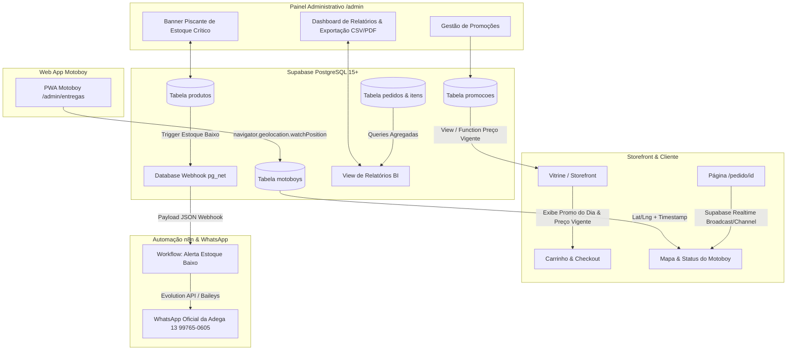
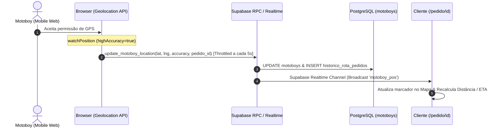

# 📄 SPEC-06-ADVANCED-FEATURES: Especificação Técnica de Funcionalidades Avançadas

**Projeto:** TELES ADEGA DELIVERY  
**DDD / Região:** (13) - Baixada Santista  
**Contato Oficial:** WhatsApp (13) 99765-0605 | Instagram [@teles.adegadelivery](https://instagram.com/teles.adegadelivery)  
**Identidade Visual:** Dark Theme (`#0D0D0D`), Amarelo Ouro (`#F59E0B`), Verde WhatsApp (`#22C55E`), Vermelho Alerta (`#EF4444`), Roxo Rota (`#8B5CF6`), Azul Info (`#3B82F6`)  
**Stack Tecnológica:** Next.js 14/15 (App Router), TypeScript, Tailwind CSS, Supabase (PostgreSQL 15+, Realtime, RLS, Edge Functions / Database Webhooks), n8n Workflow Automation, Geolocation API, Client-side CSV/PDF Engine  
**Autor:** Engenheiro de Software Sênior (Full-Stack & Database Architect)  
**Versão:** 1.0.0  
**Data:** 17/08/2026  

---

## 1. Visão Geral & Arquitetura do Módulo de Funcionalidades Avançadas

Este documento especifica as 4 frentes de engenharia que elevam o **TELES ADEGA DELIVERY** a um nível avançado de automação comercial, inteligência logística, gestão de inventário e inteligência de negócios (BI):

1. **Módulo de Promoções Temporais & Preço Dinâmico:** Regras de desconto por período, dias da semana e badges de destaque na vitrine.
2. **Rastreamento de Entrega do Motoboy em Tempo Real:** Coleta de geolocalização do entregador via web mobile e transmissão reativa ao cliente no `/pedido/[id]`.
3. **Sistema Integrado de Alerta de Estoque Baixo (Web & WhatsApp):** Monitoramento contínuo de ruptura de estoque com banner visual no Admin e disparos automáticos via n8n para o WhatsApp da adega.
4. **Painel de Relatórios Operacionais & Exportação (`/admin/relatorios`):** Métrica financeira, ranking de vendas, controle de fiado e produtividade de motoboys com exportação CSV/PDF.

---

### 1.1 Diagrama de Arquitetura Integrada (Mermaid)



---

## 2. Módulo de Promoções Temporais & Preço Dinâmico

### 2.1 Modelagem da Tabela `promocoes`

A tabela `promocoes` permite cadastrar preços promocionais com janelas temporais de data/hora e restrições por dia da semana (0 = Domingo, 1 = Segunda, ..., 6 = Sábado).

```sql
-- ============================================================================
-- TABELA: promocoes
-- ============================================================================
CREATE TABLE IF NOT EXISTS public.promocoes (
    id UUID PRIMARY KEY DEFAULT gen_random_uuid(),
    produto_id UUID NOT NULL REFERENCES public.produtos(id) ON DELETE CASCADE,
    preco_promocional NUMERIC(10, 2) NOT NULL CHECK (preco_promocional > 0),
    data_inicio TIMESTAMPTZ NOT NULL,
    data_fim TIMESTAMPTZ NOT NULL,
    dias_semana INTEGER[] NOT NULL DEFAULT '{0,1,2,3,4,5,6}',
    ativo BOOLEAN NOT NULL DEFAULT true,
    criado_em TIMESTAMPTZ NOT NULL DEFAULT timezone('America/Sao_Paulo', now()),
    atualizado_em TIMESTAMPTZ NOT NULL DEFAULT timezone('America/Sao_Paulo', now()),
    
    CONSTRAINT chk_periodo_valido CHECK (data_fim > data_inicio),
    CONSTRAINT chk_dias_semana_validos CHECK (
        dias_semana <@ ARRAY[0,1,2,3,4,5,6] AND array_length(dias_semana, 1) > 0
    )
);

-- Índices para performance de busca no catálogo
CREATE INDEX IF NOT EXISTS idx_promocoes_produto_ativo 
ON public.promocoes(produto_id, ativo, data_inicio, data_fim);

CREATE INDEX IF NOT EXISTS idx_promocoes_vigencia 
ON public.promocoes(ativo, data_inicio, data_fim);

-- Trigger de updated_at
CREATE OR REPLACE TRIGGER trg_promocoes_atualizado_em
    BEFORE UPDATE ON public.promocoes
    FOR EACH ROW
    EXECUTE FUNCTION public.fn_atualizar_timestamp();
```

---

### 2.2 Função SQL e View de Preço Vigente

A regra de negócio determina que, caso existam múltiplas promoções ativas concorrentes para o mesmo produto, a promoção com o **menor preço promocional** prevalecerá. Se nenhuma estiver ativa, o preço padrão da tabela `produtos` será o preço vigente.

```sql
-- ============================================================================
-- FUNÇÃO: fn_obter_preco_vigente
-- Retorna o preço atual de um produto considerando regras temporais (Fuso BRT)
-- ============================================================================
CREATE OR REPLACE FUNCTION public.fn_obter_preco_vigente(p_produto_id UUID)
RETURNS TABLE (
    preco_original NUMERIC(10,2),
    preco_vigente NUMERIC(10,2),
    em_promocao BOOLEAN,
    percentual_desconto INTEGER,
    promocao_id UUID
) 
LANGUAGE plpgsql
SECURITY DEFINER
STABLE
AS $$
DECLARE
    v_agora TIMESTAMPTZ := timezone('America/Sao_Paulo', now());
    v_dia_semana INTEGER := CAST(extract(DOW FROM v_agora) AS INTEGER);
    v_preco_base NUMERIC(10,2);
    v_preco_promo NUMERIC(10,2);
    v_promo_id UUID;
BEGIN
    -- Busca preço base
    SELECT preco INTO v_preco_base 
    FROM public.produtos 
    WHERE id = p_produto_id AND ativo = true;

    IF v_preco_base IS NULL THEN
        RETURN;
    END IF;

    -- Busca melhor promoção válida para a data/hora e dia da semana atual
    SELECT id, preco_promocional
    INTO v_promo_id, v_preco_promo
    FROM public.promocoes
    WHERE produto_id = p_produto_id
      AND ativo = true
      AND v_agora >= data_inicio
      AND v_agora <= data_fim
      AND v_dia_semana = ANY(dias_semana)
      AND preco_promocional < v_preco_base
    ORDER BY preco_promocional ASC
    LIMIT 1;

    IF v_preco_promo IS NOT NULL THEN
        preco_original := v_preco_base;
        preco_vigente := v_preco_promo;
        em_promocao := true;
        percentual_desconto := ROUND(((v_preco_base - v_preco_promo) / v_preco_base) * 100);
        promocao_id := v_promo_id;
    ELSE
        preco_original := v_preco_base;
        preco_vigente := v_preco_base;
        em_promocao := false;
        percentual_desconto := 0;
        promocao_id := NULL;
    END IF;

    RETURN NEXT;
END;
$$;

-- ============================================================================
-- VIEW: vw_produtos_vitrine
-- View otimizada para o Storefront já trazendo campos de preço e promoção
-- ============================================================================
CREATE OR REPLACE VIEW public.vw_produtos_vitrine AS
WITH promocoes_ativas AS (
    SELECT DISTINCT ON (produto_id)
        id AS promocao_id,
        produto_id,
        preco_promocional,
        data_fim
    FROM public.promocoes
    WHERE ativo = true
      AND timezone('America/Sao_Paulo', now()) BETWEEN data_inicio AND data_fim
      AND CAST(extract(DOW FROM timezone('America/Sao_Paulo', now())) AS INTEGER) = ANY(dias_semana)
    ORDER BY produto_id, preco_promocional ASC
)
SELECT 
    p.id,
    p.categoria_id,
    c.nome AS categoria_nome,
    p.nome,
    p.descricao,
    p.foto_url,
    p.estoque_atual,
    p.estoque_minimo,
    p.ativo,
    p.preco AS preco_original,
    COALESCE(pa.preco_promocional, p.preco) AS preco_vigente,
    (pa.preco_promocional IS NOT NULL AND pa.preco_promocional < p.preco) AS em_promocao,
    CASE 
        WHEN pa.preco_promocional IS NOT NULL AND pa.preco_promocional < p.preco THEN
            ROUND(((p.preco - pa.preco_promocional) / p.preco) * 100)::INTEGER
        ELSE 0
    END AS percentual_desconto,
    pa.promocao_id,
    pa.data_fim AS promocao_expira_em,
    p.criado_em,
    p.atualizado_em
FROM public.produtos p
INNER JOIN public.categorias c ON c.id = p.categoria_id
LEFT JOIN promocoes_ativas pa ON pa.produto_id = p.id
WHERE p.ativo = true AND c.ativo = true;
```

---

### 2.3 Especificação de UI na Vitrine (Componentes Frontend)

No storefront (`src/components/storefront/ProductCard.tsx` e `ProductModal.tsx`):

1. **Badge "PROMO DO DIA":**
   - Posição: Canto superior esquerdo do card de produto (`absolute top-2 left-2 z-10`).
   - Estilização: Fundo gradiente ouro `#F59E0B` para `#D97706`, texto preto bold `#0D0D0D`, ícone de faísca `Sparkles` ou `Flame` do Lucide.
2. **Badge de Desconto Percentual:**
   - Posição: Ao lado do badge ou sobre a imagem (`badge -XX%`).
   - Estilização: Fundo vermelho `#EF4444`, texto branco `font-extrabold text-xs px-2 py-0.5 rounded-full`.
3. **Exibição de Preço Riscado:**
   - Preço De: `text-xs text-zinc-500 line-through`. Ex: `R$ 49,90`
   - Preço Por: `text-lg font-black text-amber-400`. Ex: `R$ 39,90`
4. **Integração com Carrinho (`useCartStore`):**
   - O item adicionado ao carrinho deve registrar `preco_unitario` com o valor de `preco_vigente` e guardar `promocao_id` (se houver) para validação no backend no momento do checkout.

```tsx
// Exemplo de trecho no ProductCard.tsx
{product.em_promocao && (
  <div className="absolute top-2 left-2 z-10 flex items-center gap-1.5">
    <span className="flex items-center gap-1 bg-gradient-to-r from-amber-500 to-amber-600 text-black text-[11px] font-black uppercase tracking-wider px-2.5 py-0.5 rounded-full shadow-lg shadow-amber-500/20">
      <Sparkles className="w-3 h-3 fill-black" />
      PROMO DO DIA
    </span>
    <span className="bg-red-600 text-white text-[11px] font-black px-2 py-0.5 rounded-full shadow-md">
      -{product.percentual_desconto}%
    </span>
  </div>
)}
```

---

## 3. Rastreamento de Entrega do Motoboy em Tempo Real

### 3.1 Modelagem e Alterações no Banco de Dados

Atualização da tabela `motoboys` e histórico de telemetria da entrega:

```sql
-- ============================================================================
-- ATUALIZAÇÃO DA TABELA MOTOBOYS: Campos de Geolocalização
-- ============================================================================
ALTER TABLE public.motoboys 
ADD COLUMN IF NOT EXISTS latitude NUMERIC(10, 8),
ADD COLUMN IF NOT EXISTS longitude NUMERIC(11, 8),
ADD COLUMN IF NOT EXISTS precisao_metros NUMERIC(8, 2),
ADD COLUMN IF NOT EXISTS velocidade_kmh NUMERIC(5, 2),
ADD COLUMN IF NOT EXISTS ultima_localizacao_em TIMESTAMPTZ;

-- Índices geoespaciais e de tempo
CREATE INDEX IF NOT EXISTS idx_motoboys_localizacao 
ON public.motoboys(latitude, longitude) 
WHERE ativo = true;

-- ============================================================================
-- TABELA: historico_rota_pedidos (Para auditoria de entrega e telemetria)
-- ============================================================================
CREATE TABLE IF NOT EXISTS public.historico_rota_pedidos (
    id UUID PRIMARY KEY DEFAULT gen_random_uuid(),
    pedido_id UUID NOT NULL REFERENCES public.pedidos(id) ON DELETE CASCADE,
    motoboy_id UUID NOT NULL REFERENCES public.motoboys(id) ON DELETE CASCADE,
    latitude NUMERIC(10, 8) NOT NULL,
    longitude NUMERIC(11, 8) NOT NULL,
    registrado_em TIMESTAMPTZ NOT NULL DEFAULT timezone('America/Sao_Paulo', now())
);

CREATE INDEX IF NOT EXISTS idx_historico_rota_pedido 
ON public.historico_rota_pedidos(pedido_id, registrado_em ASC);
```

---

### 3.2 Fluxo de Coleta e Transmissão do Motoboy

O entregador acessa a interface web mobile `/admin/entregas` ou link direto de rota. Quando o pedido é colocado no status `em_rota`, o navegador inicia o monitoramento via `navigator.geolocation.watchPosition`:



#### 3.2.1 RPC de Atualização Otimizada com Throttle
```sql
CREATE OR REPLACE FUNCTION public.fn_atualizar_posicao_motoboy(
    p_motoboy_id UUID,
    p_latitude NUMERIC,
    p_longitude NUMERIC,
    p_precisao NUMERIC DEFAULT NULL,
    p_pedido_id UUID DEFAULT NULL
)
RETURNS VOID
LANGUAGE plpgsql
SECURITY DEFINER
AS $$
BEGIN
    -- Atualiza posição atual do motoboy
    UPDATE public.motoboys
    SET latitude = p_latitude,
        longitude = p_longitude,
        precisao_metros = p_precisao,
        ultima_localizacao_em = timezone('America/Sao_Paulo', now())
    WHERE id = p_motoboy_id;

    -- Se houver pedido ativo em rota, registra log histórico
    IF p_pedido_id IS NOT NULL THEN
        INSERT INTO public.historico_rota_pedidos (pedido_id, motoboy_id, latitude, longitude)
        VALUES (p_pedido_id, p_motoboy_id, p_latitude, p_longitude);
    END IF;
END;
$$;
```

---

### 3.3 Interface do Cliente (`/pedido/[id]`): Visualização do Mapa e ETA

Na página de acompanhamento do pedido (`src/app/pedido/[id]/page.tsx`):

1. **Estado `em_rota`:**
   - Ativação do componente de radar/mapa interativo (`DeliveryTrackerMap.tsx`).
   - Conexão com canal Supabase Realtime dedicado: `supabase.channel('tracking:' + pedidoId)`.
2. **Cálculo de Distância e ETA (Fórmula de Haversine + Velocidade Média Baixada Santista 25 km/h):**

$$\text{d} = 2r \arcsin\left(\sqrt{\sin^2\left(\frac{\Delta \phi}{2}\right) + \cos(\phi_1)\cos(\phi_2)\sin^2\left(\frac{\Delta \lambda}{2}\right)}\right)$$

$$\text{ETA (minutos)} = \left(\frac{\text{Distância (km)}}{25 \text{ km/h}}\right) \times 60 + 3 \text{ min (margem semafórica)}$$

3. **Elementos Visuais:**
   - Card com foto e nome do entregador.
   - Indicador pulsante roxo (`#8B5CF6`): *"Motoboy a caminho do seu endereço"*.
   - Medidor de tempo estimado dinâmico: *"Chegando em aprox. 8-12 min (1.8 km de você)"*.
   - Fallback gracioso: Se o motoboy desativar o GPS ou não houver sinal, exibe status de rota padrão sem travar a interface do cliente.

---

## 4. Sistema de Alerta de Estoque Baixo (Web & WhatsApp)

### 4.1 Banner de Alta Visibilidade no Painel Administrativo

Quando um produto atinge a condição `estoque_atual <= estoque_minimo`, um alerta crítico é disparado em todo o cabeçalho do Admin (`src/components/admin/layout/AdminHeader.tsx` e `LowStockAlertBanner.tsx`).

#### 4.1.1 Especificação Visual do Banner
- **Cores:** Fundo Vermelho translúcido `bg-red-950/80 border-b border-red-500/50 backdrop-blur-md`.
- **Animações:** Ícone de alerta `AlertTriangle` com `animate-bounce` e borda com `animate-pulse`.
- **Conteúdo:** 
  - *"⚠️ ATENÇÃO: X itens atingiram o estoque crítico!"*
  - Pills clicáveis com o nome do produto e saldo atual: `Heineken 350ml (Restam: 2 un - Mín: 10 un)`.
  - Botão de atalho direto: `[Reabastecer Agora]` direcionando para a gaveta de ajuste rápido de estoque.

---

### 4.2 Arquitetura de Notificação Automática no WhatsApp via n8n

Para evitar envio repetitivo de mensagens caso o estoque oscile rapidamente, é implementado um sistema de controle de cooldown (mínimo de 3 horas entre notificações do mesmo produto) utilizando a tabela `alertas_estoque_enviados`.

#### 4.2.1 Tabela de Controle de Disparos de Alerta
```sql
CREATE TABLE IF NOT EXISTS public.alertas_estoque_enviados (
    id UUID PRIMARY KEY DEFAULT gen_random_uuid(),
    produto_id UUID NOT NULL REFERENCES public.produtos(id) ON DELETE CASCADE,
    estoque_registrado INTEGER NOT NULL,
    estoque_minimo_registrado INTEGER NOT NULL,
    enviado_em TIMESTAMPTZ NOT NULL DEFAULT timezone('America/Sao_Paulo', now())
);

CREATE INDEX IF NOT EXISTS idx_alertas_estoque_produto_data 
ON public.alertas_estoque_enviados(produto_id, enviado_em DESC);
```

#### 4.2.2 Trigger PostgreSQL com Database Webhook
```sql
-- ============================================================================
-- FUNCTION: fn_trg_checar_estoque_baixo
-- ============================================================================
CREATE OR REPLACE FUNCTION public.fn_trg_checar_estoque_baixo()
RETURNS TRIGGER
LANGUAGE plpgsql
SECURITY DEFINER
AS $$
DECLARE
    v_ultimo_alerta TIMESTAMPTZ;
    v_webhook_url TEXT;
    v_payload JSONB;
BEGIN
    -- Verifica se atingiu estoque crítico e se houve decremento
    IF NEW.estoque_atual <= NEW.estoque_minimo AND NEW.ativo = true AND (OLD.estoque_atual > NEW.estoque_atual OR TG_OP = 'INSERT') THEN
        
        -- Checa cooldown de 3 horas para o mesmo produto
        SELECT enviado_em INTO v_ultimo_alerta
        FROM public.alertas_estoque_enviados
        WHERE produto_id = NEW.id
        ORDER BY enviado_em DESC
        LIMIT 1;

        IF v_ultimo_alerta IS NULL OR (timezone('America/Sao_Paulo', now()) - v_ultimo_alerta) > INTERVAL '3 hours' THEN
            
            -- Registra envio
            INSERT INTO public.alertas_estoque_enviados (produto_id, estoque_registrado, estoque_minimo_registrado)
            VALUES (NEW.id, NEW.estoque_atual, NEW.estoque_minimo);

            -- Monta payload JSON para o n8n
            v_payload := jsonb_build_object(
                'event', 'LOW_STOCK_ALERT',
                'timestamp', timezone('America/Sao_Paulo', now()),
                'produto', jsonb_build_object(
                    'id', NEW.id,
                    'nome', NEW.nome,
                    'estoque_atual', NEW.estoque_atual,
                    'estoque_minimo', NEW.estoque_minimo,
                    'foto_url', NEW.foto_url
                ),
                'destinatario_whatsapp', '5513997650605'
            );

            -- Disparo via pg_net (Database Webhook)
            -- SELECT net.http_post(
            --     url := 'https://n8n.telesadega.com.br/webhook/estoque-baixo',
            --     body := v_payload,
            --     headers := '{"Content-Type": "application/json"}'::jsonb
            -- );
        END IF;
    END IF;

    RETURN NEW;
END;
$$;

CREATE OR REPLACE TRIGGER trg_produtos_estoque_baixo
    AFTER INSERT OR UPDATE OF estoque_atual, estoque_minimo ON public.produtos
    FOR EACH ROW
    EXECUTE FUNCTION public.fn_trg_checar_estoque_baixo();
```

#### 4.2.3 Formato da Mensagem WhatsApp (Disparada pelo n8n)

```text
⚠️ *ALERTA DE ESTOQUE CRÍTICO - TELES ADEGA* ⚠️

🚨 *Produto:* Heineken Long Neck 330ml
📦 *Estoque Atual:* 4 unidades
📉 *Estoque Mínimo Configurado:* 12 unidades
⏰ *Data/Hora:* 17/08/2026 às 22:45

Favor providenciar a reposição com o fornecedor ou pausar o anúncio na vitrine.

🔗 *Acessar Painel de Estoque:*
https://telesadegadelivery.com.br/admin/estoque
```

---

## 5. Painel de Relatórios & Exportação (`/admin/relatorios`)

### 5.1 Estrutura de Filtros por Período

A rota `/admin/relatorios` oferece seleção rápida de período e intervalo customizado:
- **Hoje (`hoje`):** `00:00:00` até `23:59:59` da data atual (Horário de Brasília).
- **Últimos 7 dias (`ultimos_7_dias`):** Data atual menos 7 dias até o momento atual.
- **Mês Atual (`mes_atual`):** Primeiro dia do mês corrente até a data atual.
- **Personalizado (`custom`):** Datepicker duplo com `data_inicio` e `data_fim`.

---

### 5.2 Estrutura e Métricas do Relatório

#### 5.2.1 Relatório Geral (Cards de Visão Executiva)
1. **Faturamento Bruto:** Soma do `valor_total` dos pedidos com status `entregue`.
2. **Total de Pedidos:** Quantidade de pedidos entregues vs cancelados.
3. **Ticket Médio:** `Faturamento Bruto / Total de Pedidos Concluídos`.
4. **Mix de Formas de Pagamento:**
   - **Pix:** Valor e percentual (%) do faturamento.
   - **Dinheiro:** Valor e percentual (%) do faturamento (incluindo cálculo de troco exigido).
   - **Cartão (Débito/Crédito na Entrega):** Valor e percentual (%).
   - **Fiado:** Valor total lançado em fiado no período.
5. **Total de Taxas de Entrega:** Volume acumulado repassado para logística.

#### 5.2.2 Relatórios Individuais e Detalhados
1. **Ranking Top Sellers (Produtos Mais Vendidos):**
   - Posição, Foto, Nome do Produto, Quantidade Vendida, Receita Total Gerada e Participação Percentual no Faturamento.
2. **Relatório de Inadimplência e Contas de Fiado:**
   - Nome do Cliente, WhatsApp, Limite de Fiado Concedido, Saldo Devedor Atual, Data da Compra Mais Antiga em Aberto e Status de Risco (🟢 Regular, 🟡 Atenção > 15 dias, 🔴 Crítico > 30 dias).
3. **Produtividade & Acerto de Motoboys:**
   - Nome do Motoboy, Total de Entregas Realizadas, Taxa de Sucesso (%), Tempo Médio por Entrega (minutos) e Valor Total de Diária/Frete a Pagar.

---

### 5.3 Motores de Exportação Client-Side (CSV e PDF)

#### 5.3.1 Exportação para CSV (RFC 4180 com BOM UTF-8)
Garante compatibilidade total com Microsoft Excel, Google Sheets e LibreOffice Calc sem corrupção de acentos ou caracteres especiais em português:

```typescript
/**
 * Utilitário de Exportação CSV Client-Side com BOM UTF-8
 */
export function exportToCSV(filename: string, headers: string[], rows: (string | number)[][]) {
  const BOM = '\uFEFF';
  const csvContent = [
    headers.map(h => `"${h.replace(/"/g, '""')}"`).join(';'),
    ...rows.map(row => 
      row.map(val => `"${String(val ?? '').replace(/"/g, '""')}"`).join(';')
    )
  ].join('\r\n');

  const blob = new Blob([BOM + csvContent], { type: 'text/csv;charset=utf-8;' });
  const url = URL.createObjectURL(blob);
  const link = document.createElement('a');
  link.setAttribute('href', url);
  link.setAttribute('download', `${filename}_${new Date().toISOString().slice(0,10)}.csv`);
  document.body.appendChild(link);
  link.click();
  document.body.removeChild(link);
  URL.revokeObjectURL(url);
}
```

#### 5.3.2 Exportação para PDF
Utiliza biblioteca client-side de alta performance (`jspdf` + `jspdf-autotable` ou `@react-pdf/renderer` estilizado com tema escuro da marca / impressão monocromática profissional):
- Cabeçalho institucional: Logo TELES ADEGA DELIVERY, CNPJ/Contato, período filtrado e data/hora da emissão.
- Blocos de resumo executivo formatados com grids e tabelas zebradas.
- Rodapé com numeração de páginas e hash de verificação do relatório.

---

## 6. Políticas de Segurança (Row Level Security - RLS)

```sql
-- Habilitar RLS nas novas tabelas
ALTER TABLE public.promocoes ENABLE ROW LEVEL SECURITY;
ALTER TABLE public.historico_rota_pedidos ENABLE ROW LEVEL SECURITY;
ALTER TABLE public.alertas_estoque_enviados ENABLE ROW LEVEL SECURITY;

-- 1. Políticas para promocoes:
-- Público e Clientes podem apenas LER promoções ativas
CREATE POLICY "Leitura pública de promoções" 
ON public.promocoes FOR SELECT 
USING (ativo = true);

-- Apenas Administrador autenticado pode Criar/Editar/Excluir promoções
CREATE POLICY "Gerenciamento total de promoções por admins" 
ON public.promocoes FOR ALL 
TO authenticated 
USING (true) 
WITH CHECK (true);

-- 2. Políticas para historico_rota_pedidos:
-- Admin e Motoboy autenticado podem inserir pontos de rota
CREATE POLICY "Inserção de telemetria por motoboy e admin" 
ON public.historico_rota_pedidos FOR INSERT 
TO authenticated 
WITH CHECK (true);

-- Cliente pode ler apenas a rota do seu respectivo pedido
CREATE POLICY "Cliente visualiza rota do seu pedido" 
ON public.historico_rota_pedidos FOR SELECT 
USING (true);

-- 3. Políticas para alertas_estoque_enviados:
CREATE POLICY "Apenas admin gerencia alertas de estoque" 
ON public.alertas_estoque_enviados FOR ALL 
TO authenticated 
USING (true);
```

---

## 7. Definição de Pronto (Definition of Done - DoD)

O desenvolvimento das funcionalidades avançadas será considerado concluído apenas após a validação integral do checklist abaixo:

### 7.1 Checklist: Módulo de Promoções Temporais
- [ ] Tabela `promocoes` criada com restrições `CHECK`, chaves estrangeiras e índices otimizados.
- [ ] Função `fn_obter_preco_vigente` e View `vw_produtos_vitrine` testadas com diferentes cenários (promoção futura, expirada, dia da semana correto e dia da semana incorreto).
- [ ] Storefront renderiza badge dourado "PROMO DO DIA", percentual de desconto `-XX%` e preço original riscado.
- [ ] Carrinho e Checkout aplicam rigorosamente o `preco_vigente` sem permitir manipulação no client-side.
- [ ] Painel Admin possui CRUD completo de promoções com seletor de dias da semana e agendamento de data/hora.

### 7.2 Checklist: Rastreamento de Entrega do Motoboy
- [ ] Campos de geolocalização adicionados à tabela `motoboys` e tabela `historico_rota_pedidos` criada.
- [ ] PWA/Página do Motoboy coleta coordenadas via `watchPosition` com throttling de envio (5 segundos) para não sobrecarregar o banco.
- [ ] Página `/pedido/[id]` conecta ao canal Supabase Realtime e atualiza o marcador do motoboy sem refresh de tela.
- [ ] Cálculo de distância Haversine e estimativa de tempo (ETA) funcional com tratamento para perda de sinal GPS.

### 7.3 Checklist: Sistema de Alerta de Estoque Baixo
- [ ] Banner de aviso crítico piscante e de alta visibilidade implementado no topo de todas as páginas do `/admin/*`.
- [ ] Clique nos itens do banner abre modal/gaveta para reabastecimento imediato de estoque.
- [ ] Trigger PostgreSQL com checagem de cooldown (3 horas) configurada com sucesso.
- [ ] Webhook integrado com o n8n entregando a mensagem formatada no WhatsApp da adega com link direto para o estoque.

### 7.4 Checklist: Painel de Relatórios & Exportação (`/admin/relatorios`)
- [ ] Filtros temporais (Hoje, 7 dias, Mês Atual e Customizado) executam queries com agrupamento e paginação sem gargalos de latência.
- [ ] Cards de faturamento bruto, total de pedidos, ticket médio e divisão por método de pagamento (Pix, Dinheiro, Fiado) validados contra pedidos concluídos.
- [ ] Rankings Top Sellers, relatório de inadimplência de fiado e produtividade de motoboys calculados com precisão.
- [ ] Botão "Exportar CSV" gera arquivo compatível com Excel (BOM UTF-8, separador `;`).
- [ ] Botão "Exportar PDF" gera documento estilizado com identidade visual da Teles Adega pronto para impressão.
